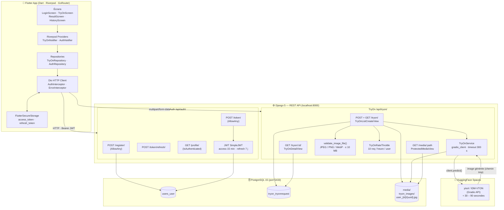
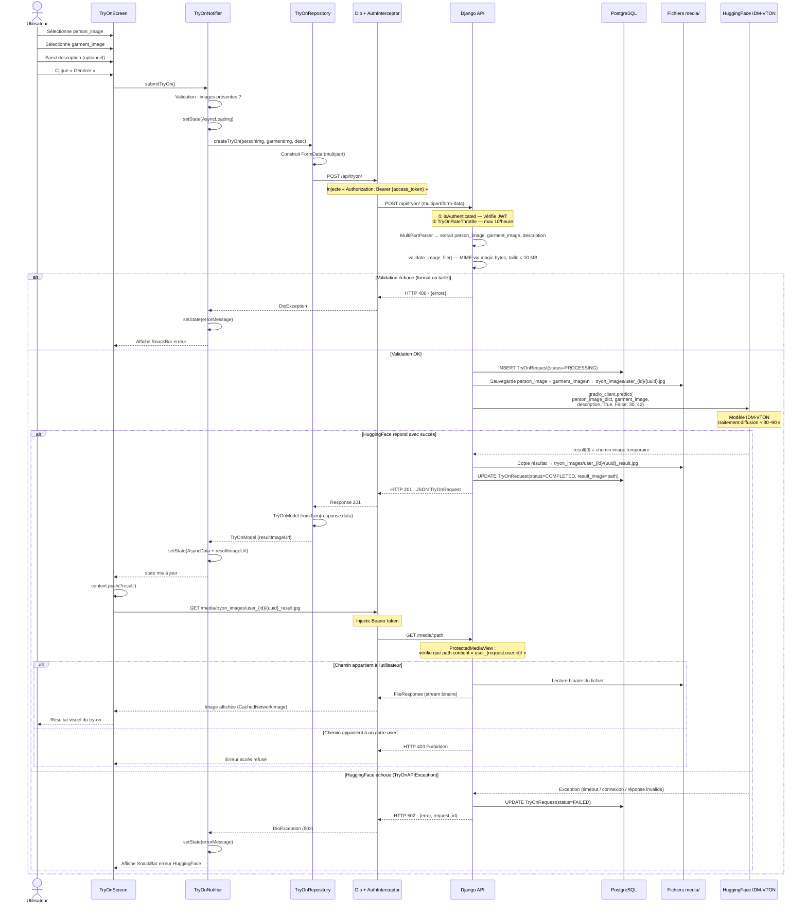
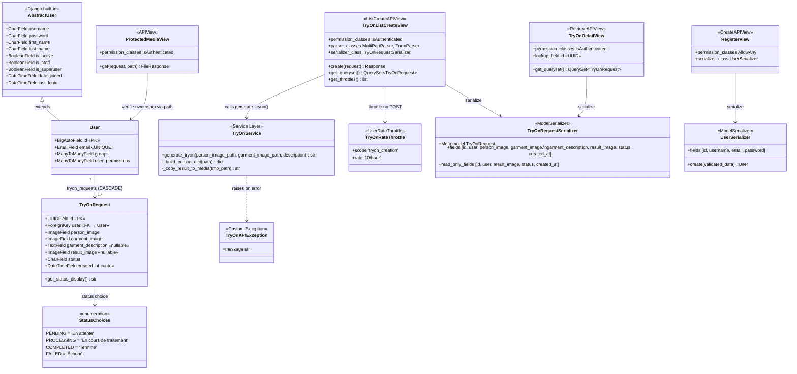
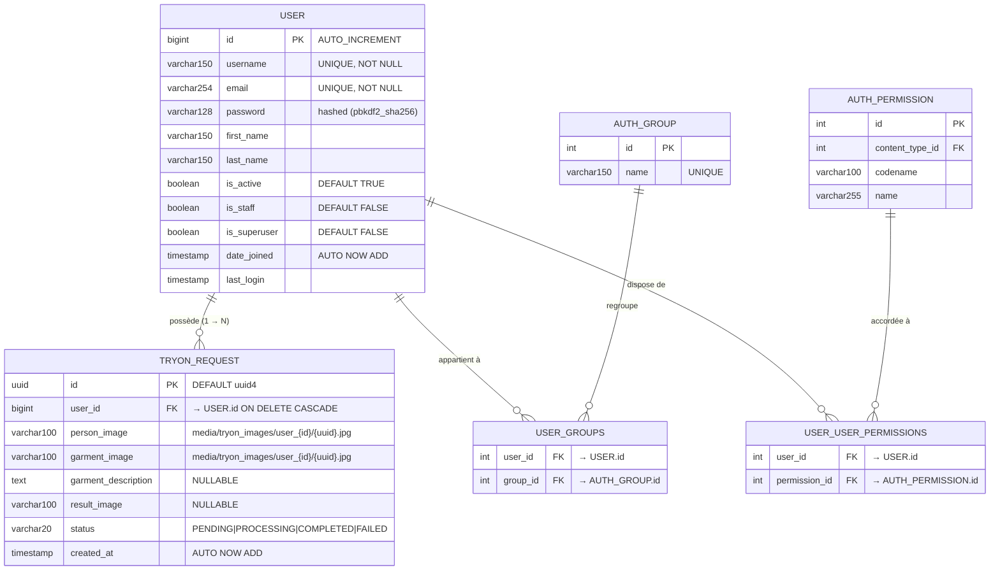

# Diagrammes — Dossier Projet Final FitAI

> Générés depuis le code source réel du projet `MSP1_BL`.  
> **Export PNG/SVG** : coller chaque bloc Mermaid sur [mermaid.live](https://mermaid.live) puis télécharger.

---

## 1. Schéma d'Architecture Globale

Flutter → Django REST API → HuggingFace IDM-VTON → PostgreSQL

---

## 2. Diagramme de Séquence — Appel Try-On Complet

upload → validation → appel HuggingFace → sauvegarde → réponse

---

## 3. Diagramme de Classes Django

---

## 4. Schéma Entité-Relation (ERD)

---

## Résumé des relations clés

| Relation | Type | Contrainte |
|---|---|---|
| `User` → `TryOnRequest` | OneToMany (ForeignKey) | `CASCADE` — suppression user = suppression requests |
| `TryOnRequest.person_image` | ImageField | `JPEG/PNG/WebP`, max 10 MB, chemin unique par UUID |
| `TryOnRequest.result_image` | ImageField | `nullable` — null si status ≠ COMPLETED |
| `TryOnRequest.status` | CharField choices | `PENDING → PROCESSING → COMPLETED \| FAILED` |
| `User.email` | EmailField | `UNIQUE` (contrainte custom par rapport à `AbstractUser`) |
