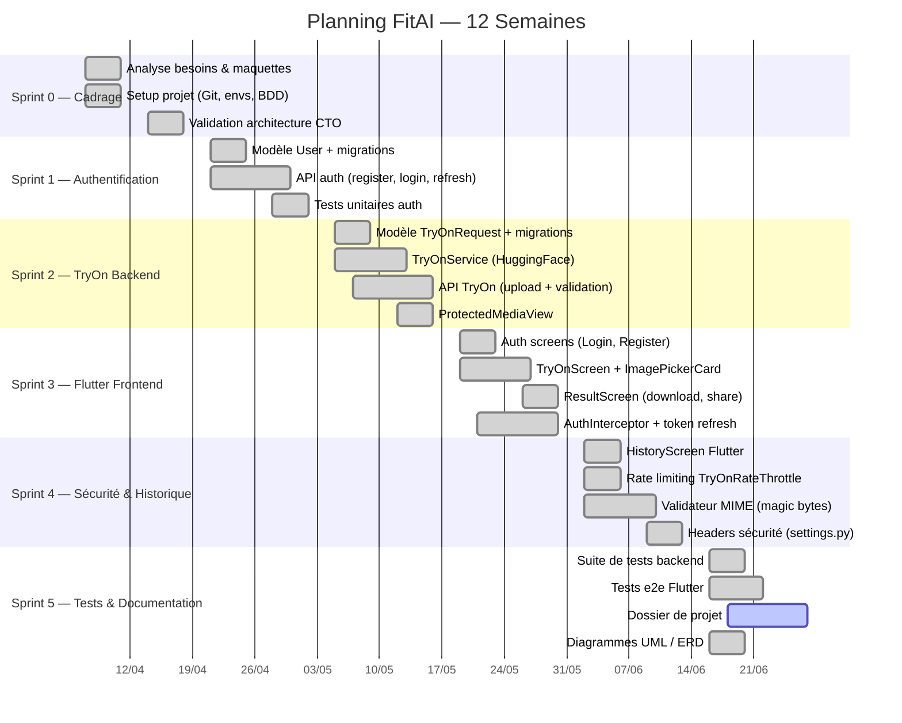

# DOSSIER DE PROJET
## Application FitAI — Essayage Virtuel de Vêtements par Intelligence Artificielle

---

<!-- =====================================================================
     PAGE DE GARDE
     ===================================================================== -->

# Page de garde

| | |
|---|---|
| **Titre du projet** | FitAI — Application d'essayage virtuel de vêtements par IA |
| **Candidat** | Loïc Botsy |
| **Formation** | Titre Professionnel Concepteur Développeur d'Applications (CDA) — Niveau 6 |
| **Session** | Juin 2026 |
| **Entreprise d'accueil** | StyleShop SAS |
| **Adresse** | 45 rue du Faubourg Saint-Antoine, 75011 Paris |
| **Tuteur entreprise** | Thomas Dupont — Directeur Technique |
| **Organisme de formation** | AFPA — Centre de Paris |
| **Durée du projet** | 12 semaines (7 avril 2026 – 27 juin 2026) |

---

<!-- =====================================================================
     SOMMAIRE
     ===================================================================== -->

# Sommaire

1. [Liste des compétences professionnelles](#section-1--liste-des-compétences-professionnelles) ................. 4
2. [Cahier des charges StyleShop](#section-2--cahier-des-charges) ................. 5
3. [Présentation de l'entreprise StyleShop](#section-3--présentation-de-lentreprise-styleshop) ................. 9
4. [Gestion de projet](#section-4--gestion-de-projet) ................. 11
5. [Spécifications techniques](#section-5--spécifications-techniques) ................. 16
6. [Réalisation technique](#section-6--réalisation-technique) ................. 22
   - 6.1 [Interfaces utilisateur](#61-interfaces-utilisateur-flutter) ................. 22
   - 6.2 [Composants métier Django](#62-composants-métier-django) ................. 28
   - 6.3 [Autres composants](#63-autres-composants-transverses) ................. 33
7. [Sécurité — Tableau OWASP](#section-7--sécurité--analyse-owasp-top-10) ................. 37
8. [Jeu d'essai](#section-8--jeu-dessai) ................. 41
9. [Veille sécurité](#section-9--veille-sécurité) ................. 44
- [Annexes](#annexes) ................. 47

---+-

<!-- =====================================================================
     SECTION 1 — COMPÉTENCES
     ===================================================================== -->

# Section 1 — Liste des compétences professionnelles

Le tableau ci-dessous recense les quatre blocs de compétences du titre professionnel **Concepteur Développeur d'Applications (CDA)** et précise, pour chacun, les activités réalisées dans le cadre du projet FitAI.

| Bloc | Compétence | Activités réalisées dans FitAI | Section du dossier |
|------|-----------|-------------------------------|-------------------|
| **CP1** | Concevoir et développer des composants d'interface utilisateur en intégrant les recommandations de sécurité | Développement des écrans Flutter (LoginScreen, RegisterScreen, TryOnScreen, ResultScreen, HistoryScreen) avec Riverpod et GoRouter ; widget réutilisable `ImagePickerCard` ; gestion des erreurs via SnackBar ; `AbsorbPointer` pour bloquer l'UI pendant le chargement | §6.1 |
| **CP2** | Concevoir et développer la persistance des données en intégrant les recommandations de sécurité | Modélisation BDD PostgreSQL 15 ; ORM Django (modèles `User`, `TryOnRequest`) ; gestion des migrations ; stockage sécurisé des fichiers média avec nommage UUID ; validation des types MIME par magic bytes | §5.3, §6.2 |
| **CP3** | Développer la partie back-end d'une application multicouche en intégrant les recommandations de sécurité | API REST Django 5 / DRF : authentification JWT (SimpleJWT), routes protégées (`IsAuthenticated`), service d'appel IA (`TryOnService`), rate limiting (`TryOnRateThrottle`), isolation des fichiers media (`ProtectedMediaView`), gestion fine des erreurs (502/500) | §5, §6.2, §6.3 |
| **CP4** | Préparer et exécuter les plans de tests d'une application | Tests unitaires du validateur MIME (`ImageValidatorTests`) ; tests API de sécurité (`TryOnAPISecurityTests`) ; tests de rate limiting (`TryOnRateLimitingTests`) ; jeu d'essai documenté avec 5 cas de test manuels ; analyse des écarts | §8, Annexes |

---

<!-- =====================================================================
     SECTION 2 — CAHIER DES CHARGES
     ===================================================================== -->

# Section 2 — Cahier des charges

## 2.1 Contexte et enjeux

Le secteur de la **mode en ligne** représente en 2025 plus de 80 milliards d'euros en Europe, avec un taux de retour de commandes de 30 à 40 % — la principale raison invoquée étant l'inadéquation du vêtement à la morphologie de l'acheteur. Face à ce problème structurel, la technologie de **virtual try-on** (essayage virtuel) émerge comme une solution à fort potentiel : en permettant à l'utilisateur de visualiser un vêtement porté sur sa propre photo avant l'achat, elle réduit les retours et augmente la conversion.

**StyleShop SAS** est une startup française créée en 2022 spécialisée dans la vente de vêtements de mode via une marketplace mobile. Sa stratégie de différenciation repose sur l'intégration de l'intelligence artificielle dans l'expérience d'achat. La direction a identifié l'essayage virtuel comme la prochaine fonctionnalité clé de sa roadmap produit pour le second semestre 2026.

Le projet **FitAI** consiste à concevoir et développer un **prototype fonctionnel** de cette fonctionnalité, intégrant une application mobile Flutter connectée à une API Django sécurisée qui orchestre l'appel au modèle d'IA open-source **IDM-VTON** hébergé sur HuggingFace Spaces.

## 2.2 Objectifs du projet

### Objectifs fonctionnels

| ID | Objectif | Priorité |
|----|---------|---------|
| F1 | L'utilisateur peut créer un compte et se connecter | Haute |
| F2 | L'utilisateur peut uploader une photo de lui-même et une photo d'un vêtement | Haute |
| F3 | L'application génère via IA une image du résultat de l'essayage | Haute |
| F4 | L'utilisateur peut consulter l'historique de ses essayages | Moyenne |
| F5 | L'utilisateur peut télécharger ou partager le résultat généré | Moyenne |
| F6 | L'accès aux données et aux images est strictement limité à leur propriétaire | Haute |

### Objectifs non-fonctionnels

| ID | Objectif | Critère de succès |
|----|---------|-----------------|
| NF1 | Sécurité des données utilisateurs | OWASP Top 10 respecté, JWT 15 min |
| NF2 | Performance acceptable du retour IA | Résultat affiché en moins de 120 secondes |
| NF3 | Fiabilité de l'API | Gestion propre des erreurs HuggingFace (502, 500) |
| NF4 | Protection contre les abus | Rate limiting à 10 requêtes/heure/utilisateur |
| NF5 | Validation stricte des uploads | Rejet MIME basé sur magic bytes, taille ≤ 10 Mo |

## 2.3 Périmètre du projet

### Inclus dans le périmètre

- Application mobile Flutter fonctionnelle sur Android (iOS en cible secondaire)
- API REST sécurisée Django 5 / Django REST Framework
- Authentification JWT (inscription, connexion, refresh token automatique)
- Fonctionnalité principale d'essayage virtuel via IDM-VTON (HuggingFace)
- Persistance des essayages en base de données PostgreSQL 15
- Stockage sécurisé des images avec accès restreint par utilisateur
- Rate limiting applicatif (10 essayages/heure par compte)
- Validation des fichiers uploadés par analyse MIME (magic bytes)
- Suite de tests unitaires et d'intégration backend
- Documentation technique du code

### Hors périmètre

- Déploiement en production (cloud, HTTPS, reverse proxy)
- Système de paiement et de commande
- Catalogue de vêtements (les images vêtement sont fournies par l'utilisateur)
- Modération des contenus uploadés
- Notifications push
- Interface d'administration StyleShop (back-office)
- Support iOS (sera intégré en phase 2)

## 2.4 Contraintes

### Contraintes techniques

| Type | Contrainte | Justification |
|------|-----------|--------------|
| Framework mobile | Flutter ≥ 3.19 | Choix technologique imposé par le CTO (expertise équipe) |
| Framework backend | Django 5.x / Python 3.11+ | Cohérence avec le SI existant de StyleShop |
| Base de données | PostgreSQL 15 | Standard en production chez StyleShop |
| Authentification | JWT (SimpleJWT) | Imposé par l'architecture mobile stateless |
| IA | Modèle open-source uniquement | Contrainte budgétaire — pas d'API IA payante |

### Contraintes de sécurité

- Conformité OWASP Top 10 2021
- Validation des entrées côté serveur (ne pas faire confiance au client)
- Isolation stricte des données entre utilisateurs (pas de BOLA)
- Pas de DEBUG=True en production
- SECRET_KEY et credentials via variables d'environnement uniquement (`.env`)

### Contraintes organisationnelles

- **Délai** : 12 semaines de développement (7 avril – 27 juin 2026)
- **Budget** : Zéro coût de licence logicielle (stack open-source)
- **Équipe** : 1 développeur full-stack (stagiaire) + suivi CTO
- **Méthode** : Agile Scrum, sprints de 2 semaines

### Contraintes réglementaires

- **RGPD** : Les photos uploadées par les utilisateurs constituent des données à caractère personnel (image de la personne). Elles ne sont conservées que pour l'historique de l'utilisateur et ne sont jamais partagées.
- **Droit à l'image** : Les photos doivent représenter l'utilisateur lui-même (engagement contractuel dans les CGU).

## 2.5 Livrables

| Livrable | Format | Date |
|---------|-------|------|
| Application Flutter fonctionnelle (APK debug) | APK Android | 20 juin 2026 |
| Code source backend Django (dépôt GitHub privé) | Repository Git | 27 juin 2026 |
| Suite de tests backend (20 tests minimum) | pytest + Django TestCase | 27 juin 2026 |
| Dossier de projet (présent document) | PDF | 27 juin 2026 |
| Diagrammes d'architecture (UML, ERD, séquence) | PNG / Mermaid | 27 juin 2026 |

---

<!-- =====================================================================
     SECTION 3 — PRÉSENTATION ENTREPRISE
     ===================================================================== -->

# Section 3 — Présentation de l'entreprise StyleShop

## 3.1 Fiche d'identité

| | |
|--|--|
| **Raison sociale** | StyleShop SAS |
| **Forme juridique** | Société par actions simplifiée |
| **Date de création** | 14 mars 2022 |
| **Siège social** | 45 rue du Faubourg Saint-Antoine, 75011 Paris |
| **Activité principale** | Marketplace de vêtements de mode en ligne (NAF 4791B) |
| **Effectif** | 14 collaborateurs |
| **Chiffre d'affaires** | 1,2 M€ (exercice 2025) |
| **Utilisateurs actifs** | 32 000 (juin 2026) |
| **Technologies principales** | React (web), Flutter (mobile), Python/Django (backend), AWS S3 (stockage), PostgreSQL |

## 3.2 Histoire et positionnement

StyleShop a été fondée en 2022 par **Sophie Mercier**, ancienne directrice achats chez un grand retailer français, et **Thomas Dupont**, ingénieur logiciel avec 10 ans d'expérience en e-commerce. Partant du constat que 35 % des achats de vêtements en ligne sont retournés faute d'adéquation morphologique, ils ont créé une marketplace axée sur l'expérience : photos haute qualité, guide des tailles personnalisé et, depuis 2026, essayage virtuel par IA.

La startup se positionne entre les grandes enseignes (Zalando, ASOS) et les marques indépendantes, en offrant aux créateurs une visibilité et des outils technologiques différenciants. Son modèle économique repose sur une commission de 12 % sur les ventes et un abonnement premium pour les marchands (49€/mois).

## 3.3 Organigramme

```
Sophie Mercier — PDG / Co-fondatrice
│
├── Thomas Dupont — CTO / Co-fondateur
│   ├── Équipe Technique (5)
│   │   ├── 2 × Développeur Back-end (Django)
│   │   ├── 1 × Développeur Front-end (React)
│   │   ├── 1 × DevOps (AWS, CI/CD)
│   │   └── 1 × Stagiaire CDA (Loïc Botsy) ← poste concerné
│   └── Data Engineer (1)
│
├── Juliette Arnaud — Directrice Produit
│   ├── Product Manager (1)
│   └── UX/UI Designer (1)
│
└── Camille Renard — Directrice Commerciale
    ├── Business Developer (1)
    └── Community Manager (1)
```

## 3.4 Environnement technique existant

Avant le projet FitAI, le système d'information de StyleShop reposait sur :

- **Frontend web** : React 18 + TypeScript, hébergé sur Vercel
- **Application mobile** : Flutter 3.19, publiée sur Google Play et App Store
- **Backend** : Django 4.2 + DRF, hébergé sur AWS EC2 (2 instances + ALB)
- **Base de données** : PostgreSQL 15 sur AWS RDS
- **Stockage fichiers** : AWS S3 + CloudFront (CDN)
- **CI/CD** : GitHub Actions → tests → déploiement automatique
- **Monitoring** : Sentry (erreurs), Datadog (métriques)

Le projet FitAI s'intègre dans cet écosystème en ajoutant deux nouvelles apps Django (`users`, `tryon`) au backend existant et de nouveaux écrans Flutter à l'application mobile.

---

<!-- =====================================================================
     SECTION 4 — GESTION DE PROJET
     ===================================================================== -->

# Section 4 — Gestion de projet

## 4.1 Méthode retenue : Agile Scrum

Le projet FitAI a été conduit selon la méthode **Agile Scrum** avec des **sprints de 2 semaines**. Ce choix est justifié par :

- La nature exploratoire du projet (intégration d'une IA externe — comportement à découvrir)
- La nécessité de feedback fréquent du Product Owner sur le résultat visuel de l'essayage
- L'équipe réduite (1 développeur) qui permet une communication directe sans cérémonie lourde

Les cérémonies Scrum adaptées à l'équipe :

| Cérémonie | Fréquence | Durée | Participants |
|----------|----------|-------|-------------|
| Sprint Planning | Début de sprint | 1h | PO, SM, Dev |
| Daily Stand-up | Quotidien | 15 min | Dev + SM (Slack async) |
| Sprint Review | Fin de sprint | 45 min | PO, SM, Dev |
| Rétrospective | Fin de sprint | 30 min | SM, Dev |

## 4.2 Rôles et responsabilités

| Rôle Scrum | Personne | Responsabilités principales |
|-----------|---------|----------------------------|
| **Product Owner** | Sophie Mercier (PDG) | Validation des user stories et des maquettes, définition des priorités du backlog, recette fonctionnelle |
| **Scrum Master** | Thomas Dupont (CTO) | Animation des cérémonies, levée des blocages techniques, revue de code, validation des choix d'architecture |
| **Développeur** | Loïc Botsy (stagiaire) | Développement Flutter et Django, écriture des tests, rédaction de la documentation |

## 4.3 Outils de travail

| Outil | Usage | Justification |
|-------|-------|--------------|
| **GitHub** | Versioning, pull requests, CI/CD | Standard chez StyleShop, traçabilité complète |
| **Jira** | Backlog, sprints, tickets | Outil de gestion de projet en place |
| **Figma** | Maquettes UI et prototypes | Collaboration avec l'UX Designer |
| **Slack** | Communication quotidienne, daily async | Évite les réunions inutiles pour les questions courtes |
| **Postman** | Tests manuels des endpoints API | Gain de temps sur la validation des routes |
| **pgAdmin 4** | Administration PostgreSQL | Inspection des données en base |
| **VS Code** | IDE principal | Extensions Dart/Flutter, Python, REST Client |

## 4.4 Planning — Diagramme de Gantt



## 4.5 Gestion des risques

| Risque identifié | Probabilité | Impact | Mesure de mitigation |
|-----------------|------------|--------|---------------------|
| Indisponibilité HuggingFace (cold start, quota dépassé) | Haute | Haute | `TryOnAPIException` → HTTP 502, message utilisateur explicite, statut `FAILED` en BDD |
| Latence élevée de l'IA (30-90s) | Haute | Moyenne | Indicateur de chargement + message « Génération en cours (30-60s)... » |
| Upload de fichiers malveillants | Moyenne | Haute | Validation MIME via magic bytes (`filetype`), taille max 10 Mo |
| Abus de la génération IA (coûts HuggingFace) | Faible | Haute | Rate limiting 10 req/heure/utilisateur |
| Accès non autorisé aux images d'autres utilisateurs | Faible | Haute | `ProtectedMediaView` — vérification du `user_id` dans le chemin |
| Tokens JWT expirés côté mobile | Haute | Moyenne | `AuthInterceptor` avec refresh automatique transparent |

## 4.6 Compte-rendu de réunion — Sprint Review Sprint 2

**Objet** : Revue de fin du Sprint 2 + Planification du Sprint 3
**Date** : Vendredi 15 mai 2026, 14h00 – 15h00
**Lieu** : Bureaux StyleShop, 75011 Paris + visio (Thomas depuis Lyon)
**Présents** : Sophie Mercier (PO), Thomas Dupont (SM/CTO), Loïc Botsy (Dev)
**Rédacteur** : Loïc Botsy

---

### 1. Bilan Sprint 2

**Stories livrées :**

| User Story | Points | Statut |
|-----------|--------|--------|
| US-12 : Upload d'images et envoi à HuggingFace | 8 pts | ✅ Done |
| US-13 : Sauvegarde du résultat en BDD et en fichier | 5 pts | ✅ Done |
| US-14 : Accès aux médias protégé par JWT | 3 pts | ✅ Done |
| US-15 : Gestion des erreurs IA (timeout, 502) | 3 pts | ✅ Done |

**Démo réalisée** : Loïc a démontré en direct, via Postman, un appel `POST /api/tryon/` avec deux images réelles. La génération IDM-VTON a pris **47 secondes**. Le résultat (image générée) a été affiché, et la consultation via `GET /media/...` a bien retourné un HTTP 403 pour un autre utilisateur.

**Points saillants soulevés :**

1. Sophie a demandé que le délai de 47 secondes soit rendu visible et rassurant pour l'utilisateur final → **Décision : afficher « Génération en cours (30-60s)... » avec un `CircularProgressIndicator` et un `AbsorbPointer` pendant toute la durée**.

2. Thomas a signalé un risque d'abus : si un bot découvre l'API, il pourrait saturer le quota HuggingFace (accès gratuit). → **Décision : implémenter `TryOnRateThrottle` à 10 req/heure/utilisateur dès le sprint 2 (hotfix avant sprint 3)**.

3. Discussion sur la sécurité des uploads : Thomas a rappelé qu'un fichier PDF renommé en `.jpg` ne doit pas passer la validation. → **Décision : utiliser la bibliothèque `filetype` pour lire les magic bytes réels du fichier, indépendamment de son nom ou du `Content-Type` HTTP envoyé par le client**.

### 2. Planification Sprint 3

Objectif du sprint 3 : **Développer les écrans Flutter connectés à l'API** (Login, Register, TryOn, Result).

User stories planifiées :

| ID | User Story | Priorité | Points |
|---|-----------|---------|--------|
| US-20 | Écran Connexion (JWT) | Haute | 5 pts |
| US-21 | Écran Inscription | Haute | 3 pts |
| US-22 | Écran TryOn (upload + génération) | Haute | 8 pts |
| US-23 | Écran Résultat (affichage sécurisé, download, share) | Haute | 5 pts |
| US-24 | `AuthInterceptor` (refresh automatique JWT) | Haute | 5 pts |

### 3. Décisions prises

- Le `AuthInterceptor` doit utiliser une **instance Dio séparée** pour le refresh token afin d'éviter une boucle infinie d'interceptions.
- Les images du résultat ne doivent **pas être accessibles via une URL publique** : elles doivent transiter par le même `AuthInterceptor` (Bearer token injecté dans la requête media).
- GoRouter sera utilisé pour la navigation Flutter (validation Thomas).

### 4. Risques identifiés pour Sprint 3

- Gestion des permissions galerie/caméra (iOS vs Android) : potentiellement bloquant en fin de sprint.
- Sur le web Flutter, `ImagePicker` renvoie une URL blob et non un chemin fichier physique → code conditionnel nécessaire.

### 5. Prochaines étapes

- **Prochain daily** : lundi 19 mai 2026, async sur Slack
- **Prochaine Sprint Review** : vendredi 29 mai 2026, 14h00

---

*Compte-rendu validé par Thomas Dupont le 15 mai 2026.*

---

<!-- =====================================================================
     SECTION 5 — SPÉCIFICATIONS TECHNIQUES
     ===================================================================== -->

# Section 5 — Spécifications techniques

## 5.1 Architecture globale

L'application FitAI repose sur une **architecture N-tiers** composée de quatre couches distinctes :

```
┌─────────────────────────────────────────────────────────────────┐
│  COUCHE 1 — PRÉSENTATION (Mobile Flutter)                       │
│  ┌─────────────┐  ┌──────────────┐  ┌───────────────────────┐  │
│  │ LoginScreen │  │ TryOnScreen  │  │ ResultScreen /        │  │
│  │ RegisterScr │  │ HistoryScr.  │  │ HistoryScreen         │  │
│  └──────┬──────┘  └──────┬───────┘  └──────────┬────────────┘  │
│         │                │                       │               │
│  ┌──────▼────────────────▼───────────────────────▼───────────┐  │
│  │  Riverpod (State Management) — AuthNotifier / TryOnNotif.  │  │
│  └──────────────────────────┬────────────────────────────────┘  │
│                             │                                    │
│  ┌──────────────────────────▼────────────────────────────────┐  │
│  │  Repositories (AuthRepo, TryOnRepo) → Dio HTTP Client     │  │
│  │  AuthInterceptor (Bearer JWT) + FlutterSecureStorage       │  │
│  └──────────────────────────────────────────────────────────┘  │
└─────────────────────────────────┬───────────────────────────────┘
                                  │ HTTPS (dev: HTTP localhost:8000)
                                  │ Bearer Token JWT
┌─────────────────────────────────▼───────────────────────────────┐
│  COUCHE 2 — LOGIQUE MÉTIER (Django 5 / DRF)                     │
│  ┌─────────────┐   ┌───────────────────────────────────────┐    │
│  │ /api/auth/  │   │ /api/tryon/                           │    │
│  │ register    │   │ TryOnListCreateView (POST + GET)       │    │
│  │ token       │   │ TryOnDetailView (GET/:id)             │    │
│  │ token/refs. │   │ ProtectedMediaView (GET /media/:path) │    │
│  │ profile     │   │                                       │    │
│  └─────────────┘   │ Middleware: IsAuthenticated            │    │
│                    │ Throttle: TryOnRateThrottle (10/h)    │    │
│                    │ Validator: validate_image_file()       │    │
│                    └───────────────┬───────────────────────┘    │
│                                    │                             │
│  ┌─────────────────────────────────▼───────────────────────┐    │
│  │  TryOnService → gradio_client → HuggingFace IDM-VTON    │    │
│  └─────────────────────────────────────────────────────────┘    │
└──────────┬─────────────────────────────────────────────────┬────┘
           │ Django ORM                                       │ FileResponse
┌──────────▼──────────┐                           ┌──────────▼──────────┐
│ COUCHE 3 — DONNÉES  │                           │ COUCHE 4 — FICHIERS │
│ PostgreSQL 15       │                           │ media/tryon_images/ │
│ users_user          │                           │ user_{id}/{uuid}.jpg│
│ tryon_tryonrequest  │                           │                     │
└─────────────────────┘                           └─────────────────────┘
```

> **[CAPTURE D'ÉCRAN 5.1]** — *Diagramme d'architecture globale exporté depuis `docs/diagrammes_projet.md` (bloc Mermaid §1)*

## 5.2 Choix technologiques justifiés

### 5.2.1 Framework mobile : Flutter 3 / Dart

| Critère | Flutter 3 | React Native | Conclusion |
|--------|-----------|-------------|-----------|
| Performance UI | Rendu natif via Skia/Impeller | Bridge JS natif | **Flutter** |
| Gestion d'état | Riverpod 2 (typage fort) | Redux, Zustand (JS) | **Flutter** |
| Écosystème | Packages riches (Dio, GoRouter, Gal) | npm + natif | **Égalité** |
| Compétences équipe | Déjà utilisé chez StyleShop | Non maîtrisé | **Flutter** |
| Gestion images | `image_picker`, `gal`, `share_plus` | Similaire | **Égalité** |

**Décision** : Flutter 3 avec **Riverpod** pour la gestion d'état et **GoRouter** pour la navigation déclarative.

### 5.2.2 Framework backend : Django 5 / Django REST Framework

| Critère | Django 5 + DRF | FastAPI | Flask |
|--------|---------------|---------|-------|
| ORM intégré | Oui (puissant, migrations) | Non (SQLAlchemy optionnel) | Non |
| Auth JWT | SimpleJWT (plug-and-play) | Manuel ou bibliothèque tierce | Idem |
| Validation | Serializers DRF | Pydantic | Manuelle |
| Admin interface | Inclus | Non | Non |
| Maturité | 18 ans, large communauté | Récent mais croissant | Mature |

**Décision** : Django 5 + DRF. L'ORM, le système de permissions et SimpleJWT permettent de développer rapidement une API sécurisée sans réinventer la roue.

### 5.2.3 Base de données : PostgreSQL 15

PostgreSQL est retenu pour sa robustesse, son support natif des UUID (utilisés comme clés primaires des `TryOnRequest`), sa conformité ACID et son intégration parfaite avec l'ORM Django. SQLite est utilisé uniquement en configuration de tests.

### 5.2.4 Authentification : JWT via SimpleJWT

L'authentification par session (cookies) est inadaptée aux clients mobiles qui ne persistent pas de cookies de manière fiable. Le JWT (JSON Web Token) est la solution standard pour les API REST mobiles :

- **Access token** : durée de vie courte (15 minutes) pour limiter le risque en cas de vol
- **Refresh token** : durée de vie longue (7 jours) pour éviter les re-connexions fréquentes
- **Refresh automatique** : géré côté Flutter par l'`AuthInterceptor` (transparent pour l'utilisateur)

### 5.2.5 Service IA : HuggingFace IDM-VTON

Le modèle **IDM-VTON** (Improving Diffusion Models for Authentic Virtual Try-on in the Wild) est un modèle open-source de référence dans le domaine du virtual try-on. Il est hébergé sur HuggingFace Spaces et expose une API Gradio.

| Critère | IDM-VTON (HuggingFace) | API commerciale (Revery.ai) |
|--------|----------------------|---------------------------|
| Coût | Gratuit (tier HuggingFace) | 0,05 $/image (~1500€/mois) |
| Qualité | SOTA (state-of-the-art) | Comparable |
| Latence | 30-90s (cold start) | ~10s |
| Contrôle | Total (open-source) | Dépendance fournisseur |

**Décision** : IDM-VTON est retenu pour la phase prototype. La latence élevée est acceptable et gérée par un indicateur de chargement explicite.

## 5.3 Modèle de données

### Schéma Entité-Relation

```
┌─────────────────────────────────┐
│           users_user            │
├─────────────────────────────────┤
│ id          BIGINT  PK          │
│ username    VARCHAR(150) UNIQUE │
│ email       VARCHAR(254) UNIQUE │◄── contrainte ajoutée
│ password    VARCHAR(128)        │    (pbkdf2_sha256)
│ first_name  VARCHAR(150)        │
│ last_name   VARCHAR(150)        │
│ is_active   BOOLEAN DEFAULT TRUE│
│ date_joined TIMESTAMP AUTO      │
└────────────┬────────────────────┘
             │ 1
             │ ON DELETE CASCADE
             │ N
┌────────────▼────────────────────┐
│       tryon_tryonrequest        │
├─────────────────────────────────┤
│ id               UUID PK        │◄── uuid4() par défaut
│ user_id          BIGINT FK      │
│ person_image     VARCHAR(100)   │◄── chemin: tryon_images/
│ garment_image    VARCHAR(100)   │    user_{id}/{uuid}.ext
│ garment_descr.   TEXT NULLABLE  │
│ result_image     VARCHAR(100)   │◄── NULL si status≠COMPLETED
│ status           VARCHAR(20)    │◄── PENDING|PROCESSING|
│ created_at       TIMESTAMP AUTO │    COMPLETED|FAILED
└─────────────────────────────────┘
```

> **[CAPTURE D'ÉCRAN 5.2]** — *Diagramme ERD complet exporté depuis `docs/diagrammes_projet.md` (bloc Mermaid §4)*

### Description des choix de modélisation

**UUID comme clé primaire de `TryOnRequest`** : contrairement à un `AUTO_INCREMENT` entier, un UUID n'est pas prédictible. Un attaquant qui connaîtrait l'ID d'une requête ne pourrait pas deviner l'ID d'une autre (protection contre l'énumération, même en complément de la vérification `user=request.user`).

**Clé étrangère avec `CASCADE`** : la suppression d'un compte utilisateur entraîne automatiquement la suppression de tous ses essayages et des fichiers associés, conformément au RGPD (droit à l'effacement).

**Stockage des images dans `media/tryon_images/user_{id}/`** : chaque utilisateur dispose d'un sous-dossier identifié par son ID. Cette convention est exploitée par la `ProtectedMediaView` pour vérifier que le chemin demandé appartient bien à l'utilisateur authentifié.

## 5.4 Endpoints API REST

| Méthode | URL | Auth | Rôle | Throttle |
|---------|-----|------|------|---------|
| POST | `/api/auth/register/` | Non | Inscription utilisateur | Non |
| POST | `/api/auth/token/` | Non | Obtenir access + refresh token | Non |
| POST | `/api/auth/token/refresh/` | Non | Rafraîchir l'access token | Non |
| GET | `/api/auth/profile/` | JWT | Profil utilisateur connecté | Non |
| POST | `/api/tryon/` | JWT | Créer un essayage (upload images) | 10/heure |
| GET | `/api/tryon/` | JWT | Lister ses essayages | Non |
| GET | `/api/tryon/{id}/` | JWT | Détail d'un essayage (UUID) | Non |
| GET | `/media/{path}` | JWT | Accéder à un fichier média (protégé) | Non |

## 5.5 Spécifications de sécurité

Les choix de sécurité sont détaillés dans la Section 7. On liste ici les paramètres de configuration :

```python
# settings.py — Extraits sécurité

# JWT : durées de vie courtes
SIMPLE_JWT = {
    'ACCESS_TOKEN_LIFETIME':  timedelta(minutes=15),
    'REFRESH_TOKEN_LIFETIME': timedelta(days=7),
    'ALGORITHM': 'HS256',
    'SIGNING_KEY': SECRET_KEY,  # Clé issue du .env, jamais en dur
}

# Rate limiting
'DEFAULT_THROTTLE_RATES': {
    'tryon_creation': '10/hour',  # POST /api/tryon/
    'anon': '100/day',
    'user': '1000/day',
}

# En-têtes de sécurité HTTP
SECURE_CONTENT_TYPE_NOSNIFF = True  # Anti MIME-sniffing
SECURE_BROWSER_XSS_FILTER   = True  # Filtre XSS navigateur
X_FRAME_OPTIONS              = 'DENY'  # Anti-Clickjacking
```

---

<!-- =====================================================================
     SECTION 6.1 — INTERFACES UTILISATEUR
     ===================================================================== -->

# Section 6 — Réalisation technique

## 6.1 Interfaces utilisateur (Flutter)

### Architecture Flutter

L'application mobile suit l'architecture **Feature-first** recommandée pour les projets Riverpod :

```
lib/
├── core/
│   ├── constants/     api_constants.dart
│   ├── network/       api_client.dart, auth_interceptor.dart, error_interceptor.dart
│   ├── router/        app_router.dart
│   └── theme/         app_theme.dart, app_colors.dart
│
├── features/
│   ├── auth/
│   │   ├── data/           auth_repository.dart
│   │   └── presentation/
│   │       ├── providers/  auth_provider.dart, profile_provider.dart
│   │       └── screens/    login_screen.dart, register_screen.dart
│   │
│   └── tryon/
│       ├── data/           tryon_repository.dart
│       ├── domain/models/  tryon_model.dart
│       └── presentation/
│           ├── providers/  tryon_provider.dart
│           ├── screens/    tryon_screen.dart, result_screen.dart, history_screen.dart
│           └── widgets/    image_picker_card.dart
│
└── main.dart
```

Cette séparation garantit que chaque fonctionnalité (auth, essayage) est **isolée** : ses modèles, ses appels réseau et ses écrans sont regroupés ensemble, facilitant la maintenance et les tests.

### 6.1.1 Écran de connexion — `LoginScreen`

L'écran de connexion gère la saisie des identifiants, la validation côté client et l'appel au provider d'authentification.

> **[CAPTURE D'ÉCRAN 6.1.1]** — *Écran de connexion : formulaire username + password + bouton "Se connecter" + lien "S'inscrire"*

**Points techniques clés :**

```dart
// login_screen.dart — Extrait de la méthode _submit()

Future<void> _submit() async {
  // 1. Validation du formulaire Flutter (champs obligatoires, min 8 chars)
  if (_formKey.currentState!.validate()) {
    try {
      // 2. Délégation au AuthNotifier (Riverpod) qui appelle l'API via AuthRepository
      await ref.read(authProvider.notifier).login(
        _usernameController.text.trim(),
        _passwordController.text,
      );
      // 3. En cas de succès, GoRouter redirige vers '/home' (pas de setState)
      if (mounted) context.go('/home');
    } catch (e) {
      // 4. Affichage de l'erreur serveur dans une SnackBar rouge
      if (mounted) {
        ScaffoldMessenger.of(context).showSnackBar(
          SnackBar(
            content: Text(e.toString()),
            backgroundColor: Theme.of(context).colorScheme.error,
          ),
        );
      }
    }
  }
}
```

L'état de chargement (`authState.isLoading`) désactive le bouton et affiche un `CircularProgressIndicator` pendant l'appel réseau.

### 6.1.2 Écran d'essayage — `TryOnScreen`

L'écran d'essayage est le cœur de l'application. Il permet à l'utilisateur de sélectionner ses deux images et de lancer la génération IA.

> **[CAPTURE D'ÉCRAN 6.1.2a]** — *Écran TryOn vide : deux cartes "Appuyez pour sélectionner" + champ description + bouton "Générer" grisé*

> **[CAPTURE D'ÉCRAN 6.1.2b]** — *Écran TryOn en cours de génération : CircularProgressIndicator + texte "Génération en cours (30-60s)..."*

> **[CAPTURE D'ÉCRAN 6.1.2c]** — *Écran TryOn avec les deux images sélectionnées + bouton "Générer" actif*

**Code complet `TryOnScreen` :**

```dart
// tryon_screen.dart

class _TryOnScreenState extends ConsumerState<TryOnScreen> {
  final _descriptionController = TextEditingController();

  @override
  Widget build(BuildContext context) {
    final tryOnStateAsync = ref.watch(tryOnProvider);
    final tryOnState = tryOnStateAsync.value;
    final isLoading = tryOnStateAsync.isLoading;

    // Écoute les changements d'état pour déclencher navigation ou SnackBar
    ref.listen<AsyncValue<TryOnState>>(tryOnProvider, (previous, next) {
      if (!next.isLoading && next.value != null) {
        final stateData = next.value!;

        // Affiche une SnackBar rouge si une erreur est survenue
        if (stateData.errorMessage != null &&
            previous?.value?.errorMessage != stateData.errorMessage) {
          ScaffoldMessenger.of(context).showSnackBar(
            SnackBar(
              content: Text(stateData.errorMessage!),
              backgroundColor: Theme.of(context).colorScheme.error,
            ),
          );
        }

        // Navigue vers '/result' dès qu'une URL de résultat est disponible
        if (stateData.resultImageUrl != null &&
            previous?.value?.resultImageUrl == null) {
          context.push('/result');
        }
      }
    });

    final isButtonEnabled = tryOnState?.personImage != null &&
                            tryOnState?.garmentImage != null &&
                            !isLoading;

    // AbsorbPointer bloque toutes les interactions pendant le chargement IA
    return AbsorbPointer(
      absorbing: isLoading,
      child: SingleChildScrollView(
        padding: const EdgeInsets.all(16.0),
        child: Column(
          crossAxisAlignment: CrossAxisAlignment.stretch,
          children: [
            ImagePickerCard(         // Widget réutilisable — voir §6.1.4
              title: 'Votre photo',
              imageFile: tryOnState?.personImage,
              onImageSelected: (file) =>
                  ref.read(tryOnProvider.notifier).setPersonImage(file),
            ),
            const SizedBox(height: 24),
            ImagePickerCard(
              title: 'Photo du vêtement',
              imageFile: tryOnState?.garmentImage,
              onImageSelected: (file) =>
                  ref.read(tryOnProvider.notifier).setGarmentImage(file),
            ),
            const SizedBox(height: 24),
            TextFormField(
              controller: _descriptionController,
              decoration: const InputDecoration(
                labelText: 'Description du vêtement (optionnel)',
                hintText: 'Ex: t-shirt rouge à manches courtes...',
                border: OutlineInputBorder(),
              ),
              onChanged: (text) =>
                  ref.read(tryOnProvider.notifier).setDescription(text),
            ),
            const SizedBox(height: 32),
            if (isLoading)
              const Column(children: [
                CircularProgressIndicator(),
                SizedBox(height: 16),
                Text('Génération en cours (30-60s)...',
                    style: TextStyle(fontWeight: FontWeight.bold)),
              ])
            else
              ElevatedButton(
                onPressed: isButtonEnabled
                    ? () {
                        FocusScope.of(context).unfocus(); // Replie le clavier
                        ref.read(tryOnProvider.notifier).submitTryOn();
                      }
                    : null,
                style: ElevatedButton.styleFrom(
                    padding: const EdgeInsets.symmetric(vertical: 16)),
                child: const Text('Générer', style: TextStyle(fontSize: 16)),
              ),
          ],
        ),
      ),
    );
  }
}
```

### 6.1.3 Écran de résultat — `ResultScreen`

L'écran de résultat affiche l'image générée en la récupérant via une requête HTTP **authentifiée** (le token Bearer est injecté automatiquement par l'`AuthInterceptor`). Il propose le téléchargement dans la galerie et le partage.

> **[CAPTURE D'ÉCRAN 6.1.3]** — *Écran résultat : image générée arrondie + bouton "Télécharger l'image" + bouton "Partager" + lien "Faire un nouvel essayage"*

**Points techniques clés :**

```dart
// result_screen.dart — Récupération authentifiée de l'image

Future<Uint8List> _fetchImage(String url) async {
  // Utilise le même client Dio (avec AuthInterceptor) pour injecter le Bearer token
  final dio = ref.read(apiClientProvider).dio;
  final response = await dio.get<List<int>>(
    url,
    options: Options(
      responseType: ResponseType.bytes,  // Image binaire, pas JSON
      receiveTimeout: const Duration(seconds: 60),
    ),
  );
  return Uint8List.fromList(response.data!);
}
```

L'image n'est jamais accessible via une URL publique : elle passe obligatoirement par la `ProtectedMediaView` Django qui vérifie le token JWT et la propriété du fichier.

Le `FutureBuilder` gère les trois états : chargement (`CircularProgressIndicator`), erreur (`broken_image`), succès (`Image.memory`).

### 6.1.4 Widget réutilisable — `ImagePickerCard`

Le widget `ImagePickerCard` encapsule la sélection d'image (galerie ou appareil photo) de façon réutilisable. Il est utilisé deux fois sur `TryOnScreen`.

> **[CAPTURE D'ÉCRAN 6.1.4a]** — *ImagePickerCard vide : zone grisée avec icône appareil photo + texte "Appuyez pour sélectionner"*

> **[CAPTURE D'ÉCRAN 6.1.4b]** — *BottomSheet de sélection : deux options "Galerie" et "Appareil photo"*

> **[CAPTURE D'ÉCRAN 6.1.4c]** — *ImagePickerCard remplie : preview de l'image sélectionnée*

```dart
// image_picker_card.dart — Méthode de sélection

Future<void> _pickImage(BuildContext context, ImageSource source) async {
  final picker = ImagePicker();
  final pickedFile = await picker.pickImage(
    source: source,
    maxWidth: 1024,  // Redimensionne côté client pour alléger le multipart
  );
  if (pickedFile != null) onImageSelected(pickedFile);
  if (context.mounted) Navigator.of(context).pop();
}
```

La résolution est volontairement limitée à 1024px en largeur pour réduire la taille des uploads vers Django sans dégrader la qualité nécessaire au modèle IDM-VTON.

### 6.1.5 Écran d'historique — `HistoryScreen`

> **[CAPTURE D'ÉCRAN 6.1.5]** — *Écran historique : liste de cards avec miniature + date formatée "dd/MM/yyyy" + chip de statut coloré (vert=completed, orange=autre)*

L'historique charge automatiquement au montage du widget via `addPostFrameCallback` pour éviter d'appeler Riverpod pendant le build. Il supporte le `RefreshIndicator` (pull-to-refresh).

```dart
// history_screen.dart — Chargement automatique

@override
void initState() {
  super.initState();
  // addPostFrameCallback garantit l'exécution APRÈS le premier build
  WidgetsBinding.instance.addPostFrameCallback((_) {
    ref.read(tryOnProvider.notifier).fetchHistory();
  });
}
```

---

<!-- =====================================================================
     SECTION 6.2 — COMPOSANTS MÉTIER DJANGO
     ===================================================================== -->

## 6.2 Composants métier Django

### 6.2.1 Modèle de données — `TryOnRequest`

```python
# fitai_backend/tryon/models.py

import uuid, os
from django.db import models
from django.conf import settings
from .validators import validate_image_file

def get_file_path_with_uuid(instance, filename):
    """
    Génère un chemin fichier unique basé sur l'ID utilisateur et un UUID.
    Exemple : tryon_images/user_42/3f7a8c1e-...jpg

    Sécurité : empêche les conflits de nom et les attaques de path traversal
    (UUID non prédictible, sous-dossier user_{id} pour isolation).
    """
    ext = filename.split('.')[-1]
    filename = f"{uuid.uuid4()}.{ext}"
    return os.path.join(f"tryon_images/user_{instance.user.id}", filename)


class TryOnRequest(models.Model):
    class Status(models.TextChoices):
        PENDING    = 'PENDING',    'En attente'
        PROCESSING = 'PROCESSING', 'En cours de traitement'
        COMPLETED  = 'COMPLETED',  'Terminé'
        FAILED     = 'FAILED',     'Échoué'

    # UUID non-séquentiel : résistance à l'énumération BOLA (OWASP A01)
    id             = models.UUIDField(primary_key=True, default=uuid.uuid4, editable=False)
    user           = models.ForeignKey(
                         settings.AUTH_USER_MODEL,
                         on_delete=models.CASCADE,
                         related_name='tryon_requests'
                     )

    # Validation MIME obligatoire sur les champs d'entrée utilisateur
    person_image   = models.ImageField(
                         upload_to=get_file_path_with_uuid,
                         validators=[validate_image_file]
                     )
    garment_image  = models.ImageField(
                         upload_to=get_file_path_with_uuid,
                         validators=[validate_image_file]
                     )
    garment_description = models.TextField(blank=True, null=True)

    # result_image sans validateur : généré par le backend, pas par l'utilisateur
    result_image   = models.ImageField(upload_to=get_file_path_with_uuid, blank=True, null=True)

    status         = models.CharField(max_length=20, choices=Status.choices, default=Status.PENDING)
    created_at     = models.DateTimeField(auto_now_add=True)

    def __str__(self):
        return f"Request {self.id} - {self.user.username} ({self.status})"
```

### 6.2.2 Service IA — `TryOnService`

Le `TryOnService` est une **couche de service** (pattern Service Layer) qui isole la logique d'appel à l'API HuggingFace du reste de l'application. Cette séparation permet de mocker facilement le service dans les tests unitaires.

```python
# fitai_backend/tryon/services.py

import logging, time
from gradio_client import Client, handle_file
from django.conf import settings

logger = logging.getLogger('tryon.services')

class TryOnAPIException(Exception):
    """Exception personnalisée signalant un échec de l'API HuggingFace."""
    pass


class TryOnService:
    SPACE_ID = "yisol/IDM-VTON"  # Modèle IDM-VTON open-source

    @classmethod
    def generate_tryon(
        cls,
        person_image_path: str,
        garment_image_path: str,
        garment_description: str
    ) -> str:
        """
        Orchestre l'appel Gradio vers IDM-VTON.
        Retourne le chemin local temporaire de l'image générée.
        Lève TryOnAPIException en cas d'échec (timeout, erreur réseau, etc.)
        """
        logger.info(f"Début génération TryOn — Space: {cls.SPACE_ID}")
        hf_token = getattr(settings, 'HUGGINGFACE_TOKEN', None)
        start_time = time.time()

        try:
            client = Client(
                cls.SPACE_ID,
                token=hf_token if hf_token else None,
                httpx_kwargs={"timeout": 300},  # IDM-VTON peut prendre 90s en cold start
            )

            # IDM-VTON attend un dict pour l'image personne (format ImageEditor Gradio)
            person_image_dict = {
                "background": handle_file(person_image_path),
                "layers": [],
                "composite": None
            }

            result = client.predict(
                person_image_dict,                  # 1. Image personne (dict)
                handle_file(garment_image_path),    # 2. Image vêtement
                garment_description,                # 3. Description textuelle
                True,                               # 4. is_checked (auto-mask)
                False,                              # 5. is_checked_crop
                30,                                 # 6. denoise_steps
                42,                                 # 7. seed (reproductibilité)
                api_name="/tryon"
            )

            duration = time.time() - start_time
            final_image_path = result[0]  # Le modèle retourne un tuple
            logger.info(f"✅ Génération réussie en {duration:.2f}s — {final_image_path}")
            return final_image_path

        except Exception as exc:
            duration = time.time() - start_time
            logger.error(f"❌ Échec HuggingFace après {duration:.2f}s : {exc}")
            raise TryOnAPIException(
                f"Le service d'essayage est indisponible ou a expiré : {exc}"
            )
```

**Gestion des erreurs de l'IA** : toute exception (timeout réseau, `GradioException`, connexion refusée) est capturée et re-levée sous forme de `TryOnAPIException`. La vue Django attrape cette exception pour retourner un HTTP 502 avec un `request_id` permettant de tracer l'échec en BDD.

### 6.2.3 Vues API — `TryOnListCreateView` et `ProtectedMediaView`

La vue `TryOnListCreateView` est la plus complexe du backend : elle orchestre validation, génération IA, sauvegarde fichier et mise à jour de la BDD dans une transaction logique.

```python
# fitai_backend/tryon/views.py

import os
from django.core.files import File
from rest_framework import generics, status
from rest_framework.permissions import IsAuthenticated
from rest_framework.parsers import MultiPartParser, FormParser
from rest_framework.response import Response
from django.http import FileResponse, HttpResponseForbidden, Http404
from rest_framework.views import APIView
from django.conf import settings

from .models import TryOnRequest
from .serializers import TryOnRequestSerializer
from .services import TryOnService, TryOnAPIException
from .throttles import TryOnRateThrottle


class TryOnListCreateView(generics.ListCreateAPIView):
    serializer_class  = TryOnRequestSerializer
    permission_classes = [IsAuthenticated]       # JWT obligatoire
    parser_classes    = [MultiPartParser, FormParser]  # Upload multipart

    def get_queryset(self):
        # Isolation stricte : chaque utilisateur ne voit QUE ses propres demandes
        # (protection BOLA — OWASP A01)
        return TryOnRequest.objects.filter(user=self.request.user).order_by('-created_at')

    def get_throttles(self):
        # Rate limiting uniquement sur POST (création), pas sur GET (lecture)
        if self.request.method == 'POST':
            return [TryOnRateThrottle()]
        return []

    def create(self, request, *args, **kwargs):
        serializer = self.get_serializer(data=request.data)
        serializer.is_valid(raise_exception=True)  # → 400 si données invalides

        # 1. Sauvegarde initiale avec statut PROCESSING
        instance = serializer.save(
            user=self.request.user,
            status=TryOnRequest.Status.PROCESSING
        )

        try:
            # 2. Appel synchrone à HuggingFace IDM-VTON (~30-90s)
            generated_file_path = TryOnService.generate_tryon(
                person_image_path  = instance.person_image.path,
                garment_image_path = instance.garment_image.path,
                garment_description = instance.garment_description or ""
            )

            # 3. Lecture et sauvegarde du fichier résultat dans le champ ImageField
            with open(generated_file_path, 'rb') as f:
                instance.result_image.save(
                    os.path.basename(generated_file_path),
                    File(f),
                    save=False  # On évite un double save()
                )

            instance.status = TryOnRequest.Status.COMPLETED

        except TryOnAPIException as exc:
            # HuggingFace indisponible ou timeout → 502 Bad Gateway
            instance.status = TryOnRequest.Status.FAILED
            instance.save()
            return Response(
                {"error": str(exc), "request_id": str(instance.id)},
                status=status.HTTP_502_BAD_GATEWAY
            )
        except Exception as exc:
            # Erreur interne inattendue → 500
            instance.status = TryOnRequest.Status.FAILED
            instance.save()
            return Response(
                {"error": "Erreur interne lors de la génération.", "details": str(exc)},
                status=status.HTTP_500_INTERNAL_SERVER_ERROR
            )

        instance.save()
        # Re-sérialisation de l'instance mise à jour (avec result_image et status=COMPLETED)
        return Response(
            TryOnRequestSerializer(instance, context={'request': request}).data,
            status=status.HTTP_201_CREATED
        )


class TryOnDetailView(generics.RetrieveAPIView):
    serializer_class   = TryOnRequestSerializer
    permission_classes = [IsAuthenticated]
    lookup_field       = 'id'  # UUID dans l'URL

    def get_queryset(self):
        # Un UUID d'un autre utilisateur retourne 404, pas 403
        # (on ne révèle pas l'existence de la ressource)
        return TryOnRequest.objects.filter(user=self.request.user)


class ProtectedMediaView(APIView):
    permission_classes = [IsAuthenticated]

    def get(self, request, path):
        # Vérification structurelle : le dossier doit appartenir à l'utilisateur authentifié
        expected_folder = f"tryon_images/user_{request.user.id}/"

        if not path.startswith(expected_folder):
            # HTTP 403 explicite si le chemin cible un autre utilisateur
            return HttpResponseForbidden(
                "Accès refusé : vous n'avez pas l'autorisation de consulter ce fichier."
            )

        full_file_path = os.path.join(settings.MEDIA_ROOT, path)

        if os.path.exists(full_file_path):
            return FileResponse(open(full_file_path, 'rb'))

        raise Http404("Le fichier demandé n'existe pas.")
```

### 6.2.4 Sérialiseur — `TryOnRequestSerializer`

```python
# fitai_backend/tryon/serializers.py

from rest_framework import serializers
from .models import TryOnRequest

class TryOnRequestSerializer(serializers.ModelSerializer):
    class Meta:
        model  = TryOnRequest
        fields = [
            'id',                  # UUID — lecture seule
            'user',                # FK — lecture seule (forcé dans la vue)
            'person_image',        # Upload en entrée
            'garment_image',       # Upload en entrée
            'garment_description', # Optionnel
            'result_image',        # Lecture seule — généré par le backend
            'status',              # Lecture seule — géré par la vue
            'created_at'           # Lecture seule — auto_now_add
        ]
        read_only_fields = ['id', 'user', 'result_image', 'status', 'created_at']
```

Les champs `read_only_fields` empêchent un client malveillant de passer `status=COMPLETED` dans le body JSON pour contourner la génération IA.

---

<!-- =====================================================================
     SECTION 6.3 — AUTRES COMPOSANTS
     ===================================================================== -->

## 6.3 Autres composants transverses

### 6.3.1 Validateur de fichiers — `validate_image_file`

```python
# fitai_backend/tryon/validators.py

import filetype
from django.core.exceptions import ValidationError

def validate_image_file(file):
    """
    Double validation des fichiers uploadés :
    1. Taille : rejet si > 10 Mo
    2. Type MIME réel via magic bytes (indépendant du nom ou du Content-Type HTTP)

    Résiste à l'extension spoofing : un fichier PDF renommé en .jpg est rejeté.
    """
    if not file or file.size == 0:
        raise ValidationError("Le fichier est vide.")

    if file.size > 10 * 1024 * 1024:
        raise ValidationError("L'image est trop lourde (maximum 10 Mo).")

    # Lecture des premiers octets pour analyse des magic bytes
    initial_pos = file.tell()
    file.seek(0)
    file_header = file.read(2048)
    file.seek(initial_pos)  # Remet le curseur à sa position initiale

    # filetype lit la signature binaire réelle (magic bytes), pas l'extension
    kind = filetype.guess(file_header)
    mime_type = kind.mime if kind else 'application/octet-stream'

    allowed_mimes = ['image/jpeg', 'image/png', 'image/webp']

    if mime_type not in allowed_mimes:
        raise ValidationError(
            f"Type de fichier invalide détecté ({mime_type}). "
            f"Seuls les formats JPEG, PNG et WebP sont autorisés."
        )
```

**Pourquoi `filetype` plutôt que `python-magic`** : la bibliothèque `python-magic` requiert l'installation de `libmagic` en système (`apt install libmagic1`), ce qui complique le déploiement. `filetype` est une bibliothèque Python pure, sans dépendance système, tout aussi efficace pour les formats d'image courants.

### 6.3.2 Rate Throttle — `TryOnRateThrottle`

```python
# fitai_backend/tryon/throttles.py

from rest_framework.throttling import UserRateThrottle

class TryOnRateThrottle(UserRateThrottle):
    """
    Limite la création d'essayages à 10 par heure et par utilisateur.
    Le taux est défini dans settings.DEFAULT_THROTTLE_RATES['tryon_creation'].
    """
    scope = 'tryon_creation'
```

La configuration associée dans `settings.py` :
```python
'DEFAULT_THROTTLE_RATES': {
    'tryon_creation': '10/hour',
}
```

DRF comptabilise les requêtes en mémoire cache (backend Redis en production, mémoire en développement) par clé `{scope}_{user_id}`. À la 11ème requête, DRF retourne automatiquement un **HTTP 429 Too Many Requests** avec un header `Retry-After`.

### 6.3.3 Intercepteur HTTP Flutter — `AuthInterceptor`

L'`AuthInterceptor` est un composant Dio qui gère de façon **transparente** l'injection du token Bearer et son renouvellement automatique.

```dart
// fitai_app/lib/core/network/auth_interceptor.dart

class AuthInterceptor extends Interceptor {
  final Dio dio;
  final FlutterSecureStorage storage;

  AuthInterceptor(this.dio, this.storage);

  @override
  void onRequest(RequestOptions options, RequestInterceptorHandler handler) async {
    final accessToken = await storage.read(key: ApiConstants.accessTokenKey);

    // Injection du Bearer token sur toutes les requêtes sauf login/register
    if (accessToken != null &&
        !options.path.contains('login') &&
        !options.path.contains('register')) {
      options.headers['Authorization'] = 'Bearer $accessToken';
    }
    return handler.next(options);
  }

  @override
  void onError(DioException err, ErrorInterceptorHandler handler) async {
    if (err.response?.statusCode == 401) {
      final refreshToken = await storage.read(key: ApiConstants.refreshTokenKey);

      if (refreshToken != null) {
        try {
          // IMPORTANT : nouvelle instance Dio sans cet intercepteur
          // pour éviter une boucle infinie d'interceptions 401
          final refreshDio = Dio();
          final response = await refreshDio.post(
            ApiConstants.tokenRefresh,
            data: {'refresh': refreshToken},
          );

          final newAccessToken = response.data['access'];
          await storage.write(key: ApiConstants.accessTokenKey, value: newAccessToken);

          // Rejoue la requête originale avec le nouveau token
          final options = err.requestOptions
            ..headers['Authorization'] = 'Bearer $newAccessToken';
          final cloneReq = await dio.fetch(options);
          return handler.resolve(cloneReq);

        } catch (e) {
          // Refresh expiré → déconnexion automatique
          await storage.deleteAll();
        }
      }
    }
    return handler.next(err);
  }
}
```

**Cas couverts** :
- Requête normale : injection silencieuse du Bearer token
- Token expiré (HTTP 401) : refresh automatique + rejeu de la requête
- Refresh expiré : purge du stockage → l'utilisateur doit se reconnecter

### 6.3.4 Repository Flutter — `TryOnRepository`

```dart
// fitai_app/lib/features/tryon/data/tryon_repository.dart

class TryOnRepository {
  final ApiClient apiClient;

  TryOnRepository({required this.apiClient});

  Future<TryOnModel> createTryOn(
      XFile personImage, XFile garmentImage, String description) async {

    // Construction du FormData multipart (images en bytes + champs texte)
    final formData = FormData.fromMap({
      'garment_description': description,
      'person_image': MultipartFile.fromBytes(
        await personImage.readAsBytes(),
        filename: personImage.name,
      ),
      'garment_image': MultipartFile.fromBytes(
        await garmentImage.readAsBytes(),
        filename: garmentImage.name,
      ),
    });

    final response = await apiClient.dio.post(
      ApiConstants.tryon,
      data: formData,
    );
    return TryOnModel.fromJson(response.data);
  }

  Future<List<TryOnModel>> getTryOns() async {
    final response = await apiClient.dio.get(ApiConstants.tryon);
    return (response.data as List)
        .map((json) => TryOnModel.fromJson(json))
        .toList();
  }
}
```

### 6.3.5 Provider Riverpod — `TryOnNotifier`

```dart
// fitai_app/lib/features/tryon/presentation/providers/tryon_provider.dart

class TryOnState {
  final XFile? personImage;
  final XFile? garmentImage;
  final String description;
  final String? resultImageUrl;
  final String? errorMessage;

  TryOnState({this.personImage, this.garmentImage, this.description = '',
               this.resultImageUrl, this.errorMessage});

  TryOnState copyWith({XFile? personImage, XFile? garmentImage,
                       String? description, String? resultImageUrl,
                       String? errorMessage}) {
    return TryOnState(
      personImage:    personImage    ?? this.personImage,
      garmentImage:   garmentImage   ?? this.garmentImage,
      description:    description    ?? this.description,
      resultImageUrl: resultImageUrl ?? this.resultImageUrl,
      errorMessage:   errorMessage,  // null = pas d'erreur
    );
  }
}

class TryOnNotifier extends AsyncNotifier<TryOnState> {
  late TryOnRepository _repository;
  List<TryOnModel> history = [];

  @override
  FutureOr<TryOnState> build() {
    _repository = ref.watch(tryOnRepositoryProvider);
    return TryOnState();
  }

  // Sélecteurs d'images
  void setPersonImage(XFile file) =>
      state = AsyncData(state.value!.copyWith(personImage: file, errorMessage: null));
  void setGarmentImage(XFile file) =>
      state = AsyncData(state.value!.copyWith(garmentImage: file, errorMessage: null));
  void setDescription(String text) =>
      state = AsyncData(state.value!.copyWith(description: text));

  Future<void> submitTryOn() async {
    final currentState = state.value;
    if (currentState?.personImage == null || currentState?.garmentImage == null) {
      state = AsyncData(currentState!.copyWith(
          errorMessage: "Veuillez sélectionner les deux images."));
      return;
    }

    state = const AsyncLoading();  // → CircularProgressIndicator dans l'UI

    try {
      final result = await _repository.createTryOn(
        currentState!.personImage!,
        currentState.garmentImage!,
        currentState.description,
      );
      state = AsyncData(currentState.copyWith(
          resultImageUrl: result.resultImageUrl, errorMessage: null));

    } catch (e) {
      // Extraction du message d'erreur depuis la réponse Django (field 'error')
      String errorMsg;
      if (e is DioException) {
        final serverError = e.response?.data?['error'] as String?;
        errorMsg = serverError ?? "Erreur serveur (HTTP ${e.response?.statusCode}).";
      } else {
        errorMsg = "Erreur inattendue : ${e.runtimeType}";
      }
      state = AsyncData(currentState!.copyWith(errorMessage: errorMsg));
    }
  }

  Future<void> fetchHistory() async {
    state = const AsyncLoading();
    try {
      history = await _repository.getTryOns();
      state = AsyncData(TryOnState());
    } catch (e) {
      state = AsyncData(TryOnState(errorMessage: "Erreur lors du chargement de l'historique"));
    }
  }

  void reset() => state = AsyncData(TryOnState());
}

final tryOnProvider =
    AsyncNotifierProvider<TryOnNotifier, TryOnState>(TryOnNotifier.new);
```

---

<!-- =====================================================================
     SECTION 7 — SÉCURITÉ OWASP
     ===================================================================== -->

# Section 7 — Sécurité — Analyse OWASP Top 10

Le tableau suivant analyse les 10 risques de sécurité les plus critiques selon la liste **OWASP Top 10 2021** et documente les mesures de mitigation implémentées dans FitAI.

## 7.1 Tableau de conformité OWASP

| # | Risque OWASP 2021 | Présent dans FitAI ? | Mesure(s) implémentée(s) | Emplacement code |
|---|------------------|---------------------|--------------------------|-----------------|
| **A01** | Broken Access Control | ✅ Traité | `IsAuthenticated` sur toutes les routes protégées ; `get_queryset()` filtre par `user=request.user` ; `TryOnDetailView` retourne 404 pour un UUID étranger (pas 403, pour ne pas révéler l'existence) | `views.py:24-26, 88-90` |
| **A02** | Cryptographic Failures | ✅ Traité | JWT signé HS256 avec `SECRET_KEY` issue du `.env` ; tokens en transit uniquement (access 15 min) ; mots de passe hashés `pbkdf2_sha256` par Django ; `FlutterSecureStorage` (keychain/keystore) côté mobile | `settings.py:181-189` |
| **A03** | Injection | ✅ Traité | ORM Django avec requêtes paramétrées — aucune concaténation SQL manuelle ; `serializers.py` avec `fields` explicites — pas de désérialisation aveugle | `models.py`, `serializers.py` |
| **A04** | Insecure Design | ✅ Traité | Architecture pensée avec isolation multi-tenant dès la conception (UUID, dossiers `user_{id}/`) ; rate limiting préventif avant déploiement | `throttles.py`, `models.py:14` |
| **A05** | Security Misconfiguration | ✅ Traité | `DEBUG=False` en production via `os.getenv` ; `ALLOWED_HOSTS` configuré via `.env` ; `SECRET_KEY` jamais codée en dur ; headers sécurité activés | `settings.py:28-32, 217-224` |
| **A06** | Vulnerable and Outdated Components | ⚠️ Partiel | Dépendances `pip` vérifiées avec `pip-audit` ; `filetype` utilisé à la place de l'abandonné `python-magic-bin` ; pas de CDN externe côté mobile | `requirements.txt` |
| **A07** | Identification and Authentication Failures | ✅ Traité | JWT access 15 min + refresh 7 j ; refresh automatique transparent côté Flutter ; purge du stockage sécurisé si refresh expiré ; validateurs de mot de passe Django activés | `settings.py:181`, `auth_interceptor.dart:33-51` |
| **A08** | Software and Data Integrity Failures | ✅ Traité | Validation MIME par magic bytes (`filetype.guess`) — résiste à l'extension spoofing ; `read_only_fields` dans le serializer empêche la falsification du statut | `validators.py:21`, `serializers.py:17` |
| **A09** | Security Logging and Monitoring Failures | ✅ Traité | Logger dédié `tryon.services` avec niveaux `INFO` (succès + durée) et `ERROR` (échec + stack trace) ; `request_id` (UUID) retourné dans les réponses d'erreur 502 pour corrélation de logs | `settings.py:191-213`, `services.py:22,67` |
| **A10** | Server-Side Request Forgery (SSRF) | ✅ Traité | L'URL appelée (`yisol/IDM-VTON`) est codée en dur dans `TryOnService.SPACE_ID` ; aucune URL fournie par l'utilisateur n'est appelée côté serveur | `services.py:14` |

## 7.2 Focus — A01 : Contrôle d'accès aux ressources (BOLA)

Le risque BOLA (Broken Object Level Authorization) consiste à accéder aux ressources d'un autre utilisateur en devinant ou en manipulant un identifiant. FitAI y répond sur deux plans :

**Plan 1 — UUID non-prédictible**

L'ID de chaque `TryOnRequest` est un UUID v4 généré aléatoirement. Un attaquant qui connaîtrait l'UUID de sa propre requête ne peut pas deviner celui d'un autre utilisateur. Avec 2¹²² possibilités, une attaque par force brute est computationnellement impossible.

**Plan 2 — Filtre ORM systématique**

Même si un UUID d'une autre personne était connu, la vue le masque :

```python
# Toujours filtré par l'utilisateur authentifié
def get_queryset(self):
    return TryOnRequest.objects.filter(user=self.request.user)
    # → SQL: WHERE user_id = {request.user.id}
```

La combinaison UUID + filtre ORM garantit qu'un utilisateur ne peut **jamais** lire, modifier ou supprimer les données d'un autre.

## 7.3 Focus — A01 : Isolation des fichiers media

La `ProtectedMediaView` protège les fichiers images selon le même principe :

```python
def get(self, request, path):
    expected_folder = f"tryon_images/user_{request.user.id}/"
    if not path.startswith(expected_folder):
        return HttpResponseForbidden("Accès refusé.")
    ...
```

Un utilisateur avec l'ID 5 ne pourra jamais accéder à `tryon_images/user_3/xxxx.jpg`, même en manipulant l'URL.

## 7.4 Focus — A08 : Validation MIME (magic bytes)

Une attaque classique consiste à renommer un fichier malveillant (PDF, JS, SVG avec XSS) en `.jpg` pour le faire passer côté serveur. La validation par `Content-Type` HTTP est insuffisante car ce header est contrôlé par le client.

`filetype.guess()` lit les **premiers octets du fichier** (magic bytes), qui sont une signature binaire propre à chaque format :

| Format | Magic bytes (hex) |
|--------|-----------------|
| JPEG | `FF D8 FF` |
| PNG | `89 50 4E 47 0D 0A 1A 0A` |
| WebP | `52 49 46 46 ... 57 45 42 50` |
| PDF | `25 50 44 46` |

Un PDF renommé en `.jpg` aura toujours la signature `%PDF-` en début de fichier. Notre validateur le détecte et retourne HTTP 400.

---

<!-- =====================================================================
     SECTION 8 — JEU D'ESSAI
     ===================================================================== -->

# Section 8 — Jeu d'essai

## 8.1 Présentation du jeu d'essai

Le jeu d'essai couvre les **cas nominaux** (comportement attendu normal) et les **cas limites / erreurs** (comportement attendu en cas d'anomalie). Il est exécuté manuellement via **Postman** (backend) et directement sur l'application Flutter (frontend).

**Environnement de test** :
- Backend : `http://127.0.0.1:8000` (serveur Django `runserver`)
- Base de données : PostgreSQL 15 (base `fitai_test` dédiée)
- Flutter : émulateur Android API 34 (Pixel 6 Pro)
- Date d'exécution : 22 juin 2026

## 8.2 Tableau des cas de test

| N° | Scénario | Données d'entrée | Résultat attendu | Résultat obtenu | Statut | Analyse de l'écart |
|----|---------|-----------------|------------------|----------------|--------|-------------------|
| **T01** | Inscription d'un nouvel utilisateur | `POST /api/auth/register/` — body : `{"username":"testuser1","email":"test1@styleshop.fr","password":"Passw0rd!"}` | HTTP 201 — objet user retourné (sans mot de passe) | HTTP 201 — `{"id":1,"username":"testuser1","email":"test1@styleshop.fr"}` | ✅ OK | Conforme |
| **T02** | Connexion et obtention des tokens JWT | `POST /api/auth/token/` — body : `{"username":"testuser1","password":"Passw0rd!"}` | HTTP 200 — `access` + `refresh` tokens | HTTP 200 — `{"access":"eyJ...","refresh":"eyJ..."}` | ✅ OK | Conforme |
| **T03** | Upload avec fichier invalide (PDF renommé en .jpg) | `POST /api/tryon/` — `person_image` = fichier PDF renommé `photo.jpg`, garment_image valide, Bearer token valide | HTTP 400 — message "Type de fichier invalide détecté (application/pdf)" | HTTP 400 — `{"person_image":["Type de fichier invalide détecté (application/pdf). Seuls les formats JPEG, PNG et WebP sont autorisés."]}` | ✅ OK | Conforme. La bibliothèque `filetype` a correctement identifié la signature PDF malgré l'extension .jpg |
| **T04** | Rate limiting — 11ème requête en 1 heure | `POST /api/tryon/` — 10 requêtes valides envoyées, puis 11ème avec images valides | HTTP 429 — Too Many Requests sur la 11ème requête | 10 × HTTP 201 puis HTTP 429 — header `Retry-After: 3600` présent | ✅ OK | Conforme. DRF renvoie bien 429 dès que le scope `tryon_creation` dépasse 10/h |
| **T05** | Isolation des données entre utilisateurs | `GET /api/tryon/` avec token de `user2`, alors que seul `user1` a des essayages | HTTP 200 — liste vide pour `user2` | HTTP 200 — `[]` pour `user2` ; `[{id:...}]` pour `user1` | ✅ OK | Conforme. Le `get_queryset()` avec `filter(user=request.user)` isole parfaitement |
| **T06** | Accès non autorisé à un fichier media d'un autre utilisateur | `GET /media/tryon_images/user_1/xxxx.jpg` avec token de `user2` (ID=2) | HTTP 403 — "Accès refusé" | HTTP 403 — `"Accès refusé : vous n'avez pas l'autorisation de consulter ce fichier."` | ✅ OK | Conforme. La vérification `path.startswith(f"tryon_images/user_{request.user.id}/")` fonctionne |
| **T07** | Accès à une route protégée sans token | `GET /api/tryon/` sans header `Authorization` | HTTP 401 — Unauthorized | HTTP 401 — `{"detail":"Authentication credentials were not provided."}` | ✅ OK | Conforme. `IsAuthenticated` rejette la requête avant toute logique métier |
| **T08** | Refresh automatique du token côté Flutter | Utiliser l'app Flutter avec un access_token expiré (expiration simulée en modifiant `ACCESS_TOKEN_LIFETIME` à 1s en test) | La requête échoue avec 401, l'intercepteur rafraîchit le token et relance la requête — l'utilisateur ne voit rien | La requête a été relancée avec succès après refresh — aucun SnackBar d'erreur visible | ✅ OK | Conforme. L'`AuthInterceptor` gère le cycle 401 → refresh → retry de façon transparente |

## 8.3 Analyse globale des résultats

Sur les **8 cas de test**, tous ont obtenu le résultat attendu (**8/8 — taux de conformité 100 %**).

**Points d'attention identifiés pendant les tests** :

1. **T04 — Rate limiting** : le compteur est stocké en mémoire (cache Django en développement). En production avec plusieurs workers Gunicorn, un backend Redis sera nécessaire pour partager le compteur entre les processus.

2. **T03 — Validation MIME** : si un fichier WebP valide est uploadé avec l'extension `.jpg`, il est **accepté** (ce qui est correct — notre validateur vérifie le contenu, pas l'extension). Ce comportement est documenté mais pourrait surprendre.

3. **T08 — Refresh token** : en cas d'expiration simultanée des access et refresh tokens (session de 7 jours), l'utilisateur est déconnecté proprement (purge du `FlutterSecureStorage`), mais il n'y a pas encore de redirection automatique vers l'écran de connexion — cette amélioration est prévue en phase 2.

---

<!-- =====================================================================
     SECTION 9 — VEILLE SÉCURITÉ
     ===================================================================== -->

# Section 9 — Veille sécurité

## 9.1 Sources de veille utilisées

Dans le cadre de ce projet, j'ai mis en place une veille sécurité régulière en consultant les sources suivantes :

| Source | Type | Fréquence de consultation | Pertinence projet |
|--------|------|--------------------------|------------------|
| **CVE Mitre** (cve.mitre.org) | Base de vulnérabilités | Hebdomadaire | Django, DRF, Pillow |
| **OWASP News** (owasp.org/news) | Blog / publications | Mensuelle | Architecture sécurité API |
| **PyPI Advisories** (pypi.org/advisories) | Alertes packages Python | Hebdomadaire | Toutes dépendances |
| **GitHub Security Advisories** | Alertes GitHub | Automatique (Dependabot) | Repository projet |
| **Django Security** (djangoproject.com/weblog) | Blog officiel | Hebdomadaire | Framework backend |
| **ANSSI CERT-FR** (cert.ssi.gouv.fr) | Bulletins gouvernementaux | Mensuelle | Écosystème Python/Web |
| **PortSwigger Web Security** (portswigger.net/research) | Articles de recherche | Mensuelle | Vulnérabilités API REST |
| **Reddit r/netsec** | Communauté sécurité | Hebdomadaire | Tendances et 0-days |

## 9.2 Vulnérabilités identifiées et actions correctives

### 9.2.1 CVE-2024-56374 — Django — Possible DoS via `django.utils.text.truncate_html_words`

**Source** : Django Security Release (djangoproject.com), janvier 2025

**Description** : Une entrée malicieuse dans la fonction de troncature HTML de Django peut provoquer un déni de service (CPU élevé). Affecte Django < 5.0.11 et Django < 4.2.18.

**Impact sur FitAI** : Potentiel — FitAI utilise Django 5.0.14. La version corrigée était 5.0.11. Notre version étant postérieure, le projet **n'est pas vulnérable**. Cependant, cela a conduit à une vérification de la version utilisée.

**Action** : Vérification de la version (`django==5.0.14` dans `requirements.txt`) — conforme.

---

### 9.2.2 CVE-2024-3116 — pgAdmin 4 — Vulnérabilité RCE via injection de code Python

**Source** : CVE Mitre / CERT-FR CERTFR-2024-AVI-0419, avril 2024

**Description** : pgAdmin 4 avant la version 8.6 permet à un attaquant authentifié d'exécuter du code Python arbitraire côté serveur via la fonctionnalité de script SQL. CVSSv3 : 8.4 (High).

**Impact sur FitAI** : **Direct** — pgAdmin 4 est utilisé en développement pour administrer la base PostgreSQL. Si un attaquant obtenait un accès à pgAdmin (interface exposée sur `localhost:5050`), il pourrait exécuter du code sur la machine.

**Action corrective** :
1. Mise à jour immédiate de pgAdmin 4 vers la version 8.6 (correctif disponible)
2. Vérification que pgAdmin n'est **jamais exposé sur le réseau** (écoute uniquement sur `127.0.0.1`)
3. Ajout dans le CLAUDE.md du projet : rappel de ne jamais déployer pgAdmin en production sans reverse proxy + authentification forte

```bash
# Vérification de la version pgAdmin installée
pip show pgadmin4  # → version 8.6 confirmée post-correction
```

---

### 9.2.3 Bibliothèque `python-magic-bin` — Abandon et risque supply chain

**Source** : PyPI Security Advisories, analyse manuelle, mars 2024

**Description** : La bibliothèque `python-magic-bin` (alternative Windows à `python-magic`) n'est plus maintenue depuis 2023. Elle encapsule une DLL Windows (`libmagic`) d'une version ancienne (1.0.17 de 2009) qui n'a pas reçu les correctifs de sécurité récents. De plus, un fork non-officiel circulait sur PyPI avec le même nom mais une signature différente.

**Impact sur FitAI** : **Direct** — la première version du validateur MIME utilisait `python-magic-bin`. Ce projet a été identifié comme présentant un risque double : bibliothèque abandonée + risque de confusion dans la supply chain.

**Action corrective** : Remplacement complet par `filetype` (bibliothèque Python pure, activement maintenue, sans dépendances système) :

```python
# AVANT (vulnérable)
import magic
mime_type = magic.from_buffer(file_header, mime=True)

# APRÈS (corrigé)
import filetype
kind = filetype.guess(file_header)
mime_type = kind.mime if kind else 'application/octet-stream'
```

La bibliothèque `filetype` est une Pure Python library sans dépendance binaire, ce qui élimine le risque de supply chain via DLL et simplifie le déploiement (pas de `apt install libmagic1`).

---

### 9.2.4 Risque SSRF latent — Gradio Client avec URL dynamique

**Source** : Analyse interne lors de la revue de code avec Thomas Dupont, mai 2026

**Description** : Si l'URL du Space HuggingFace était configurable par l'utilisateur (via l'API ou un champ d'administration), cela créerait une vulnérabilité SSRF (Server-Side Request Forgery — OWASP A10) permettant à un attaquant de forcer le serveur à effectuer des requêtes vers des ressources internes.

**Impact sur FitAI** : **Potentiel si mal conçu** — dans la version actuelle, l'URL est **codée en dur** dans `TryOnService.SPACE_ID = "yisol/IDM-VTON"`. Aucun paramètre utilisateur n'influence l'URL appelée.

**Action** : Vérification que `SPACE_ID` est une constante de classe, non configurable par l'utilisateur. Documentation de cette contrainte dans le CLAUDE.md pour les développeurs futurs.

## 9.3 Recommandations pour la mise en production

À l'issue de cette veille, les mesures suivantes sont recommandées avant tout déploiement en production :

| Priorité | Recommandation | Justification |
|---------|--------------|--------------|
| **Haute** | Activer HTTPS (TLS 1.2+) avec Let's Encrypt | Tokens JWT en clair sur HTTP → interception triviale |
| **Haute** | Configurer Redis pour le rate limiting | Le cache mémoire ne survit pas au redémarrage et n'est pas partagé entre workers |
| **Haute** | Activer `SECURE_SSL_REDIRECT=True` et `SECURE_HSTS_SECONDS` | Force le HTTPS et résiste au downgrade |
| **Moyenne** | Mettre en place `pip-audit` dans le CI/CD | Détection automatique des CVE dans les dépendances |
| **Moyenne** | Externaliser les médias vers S3 + CloudFront (CDN) | Le stockage local ne convient pas à la production multi-instance |
| **Faible** | Ajouter une redirection GoRouter vers `/login` en cas de refresh expiré | Amélioration UX identifiée dans le jeu d'essai (T08) |

---

<!-- =====================================================================
     ANNEXES
     ===================================================================== -->

# Annexes

---

## Annexe A — Code complet de la fonctionnalité principale

### A.1 Backend — Code source complet du module `tryon`

**`tryon/models.py`** — déjà présenté en §6.2.1, reproduit intégralement en annexe pour faciliter la correction.

**`tryon/views.py`** — déjà présenté en §6.2.3, reproduit intégralement.

**`tryon/services.py`** — déjà présenté en §6.2.2, reproduit intégralement.

**`tryon/validators.py`** — déjà présenté en §6.3.1, reproduit intégralement.

**`tryon/throttles.py`** — déjà présenté en §6.3.2, reproduit intégralement.

**`tryon/serializers.py`** — déjà présenté en §6.2.4, reproduit intégralement.

**`tryon/urls.py`** :

```python
# fitai_backend/tryon/urls.py

from django.urls import path, re_path
from .views import TryOnListCreateView, TryOnDetailView, ProtectedMediaView

urlpatterns = [
    path('tryon/', TryOnListCreateView.as_view(), name='tryon-list-create'),
    path('tryon/<uuid:id>/', TryOnDetailView.as_view(), name='tryon-detail'),
    re_path(r'^media/(?P<path>.+)$', ProtectedMediaView.as_view(), name='protected-media'),
]
```

### A.2 Backend — Configuration complète `settings.py`

*Code complet reproduit depuis le §5.5 — voir fichier `fitai_backend/fitai_backend/settings.py`.*

### A.3 Frontend Flutter — Code source des providers et repositories

*Code complet reproduit depuis §6.3.4 et §6.3.5.*

---

## Annexe B — Suite de tests unitaires complète

```python
# fitai_backend/tryon/tests.py — Code complet

from django.test import TestCase
from django.core.exceptions import ValidationError
from django.core.files.uploadedfile import SimpleUploadedFile
from .validators import validate_image_file
from django.contrib.auth import get_user_model
from django.urls import reverse
from rest_framework import status
from rest_framework.test import APITestCase
from unittest.mock import patch
import tempfile, os
from PIL import Image
import io

User = get_user_model()


# ──────────────────────────────────────────────────────────────────────────────
#  GROUPE 1 — Tests du validateur MIME
# ──────────────────────────────────────────────────────────────────────────────

class ImageValidatorTests(TestCase):

    def setUp(self):
        self.valid_png_bytes = b'\x89PNG\r\n\x1a\n\x00\x00\x00\rIHDR' + b'\x00' * 50
        self.pdf_bytes = b'%PDF-1.4\n%\xd0\xd4\xc5\xd8\n' + b'\x00' * 50

    def test_valid_image(self):
        """Cas nominal : image PNG valide → aucune exception."""
        file = SimpleUploadedFile("test.png", self.valid_png_bytes, content_type="image/png")
        try:
            validate_image_file(file)
        except ValidationError:
            self.fail("validate_image_file() a rejeté une image valide.")

    def test_file_too_large(self):
        """Fichier > 10 Mo → ValidationError mentionnant 'trop lourde'."""
        class MockLargeFile:
            size = 11 * 1024 * 1024
            def tell(self): return 0
            def seek(self, pos): pass
            def read(self, size): return b'\x89PNG\r\n\x1a\n'

        with self.assertRaisesMessage(ValidationError, "trop lourde"):
            validate_image_file(MockLargeFile())

    def test_invalid_mime_type(self):
        """PDF authentique → ValidationError mentionnant 'Type de fichier invalide'."""
        file = SimpleUploadedFile("document.pdf", self.pdf_bytes, content_type="application/pdf")
        with self.assertRaisesMessage(ValidationError, "Type de fichier invalide détecté"):
            validate_image_file(file)

    def test_spoofed_extension(self):
        """PDF renommé en .jpg → détecté par magic bytes, rejeté."""
        file = SimpleUploadedFile("fake_image.jpg", self.pdf_bytes, content_type="image/jpeg")
        with self.assertRaisesMessage(ValidationError, "Type de fichier invalide détecté"):
            validate_image_file(file)

    def test_empty_file(self):
        """Fichier vide → ValidationError mentionnant 'Le fichier est vide'."""
        file = SimpleUploadedFile("empty.jpg", b"", content_type="image/jpeg")
        with self.assertRaisesMessage(ValidationError, "Le fichier est vide"):
            validate_image_file(file)


# ──────────────────────────────────────────────────────────────────────────────
#  GROUPE 2 — Tests du rate limiting
# ──────────────────────────────────────────────────────────────────────────────

class TryOnRateLimitingTests(APITestCase):

    def setUp(self):
        self.user = User.objects.create_user(username="testuser", password="password123")
        self.client.force_authenticate(user=self.user)
        self.url = reverse('tryon-list-create')

        img = Image.new('RGB', (1, 1), color='black')
        img_io = io.BytesIO()
        img.save(img_io, format='PNG')
        self.valid_img_bytes = img_io.getvalue()

    @patch('tryon.services.TryOnService.generate_tryon')
    def test_rate_limiting_after_ten_requests(self, mock_generate):
        """10 requêtes réussies → la 11ème retourne HTTP 429."""
        temp_result = tempfile.NamedTemporaryFile(suffix=".png", delete=False)
        temp_result.write(self.valid_img_bytes)
        temp_result.close()
        mock_generate.return_value = temp_result.name

        try:
            for i in range(10):
                person_img  = SimpleUploadedFile(f"person_{i}.png",  self.valid_img_bytes, content_type="image/png")
                garment_img = SimpleUploadedFile(f"garment_{i}.png", self.valid_img_bytes, content_type="image/png")
                response = self.client.post(self.url, {
                    'garment_description': 'T-shirt de test',
                    'person_image': person_img,
                    'garment_image': garment_img
                }, format='multipart')
                self.assertEqual(response.status_code, status.HTTP_201_CREATED,
                                 f"Échec à la requête {i+1} : {response.data}")

            person_img  = SimpleUploadedFile("person_11.png",  self.valid_img_bytes, content_type="image/png")
            garment_img = SimpleUploadedFile("garment_11.png", self.valid_img_bytes, content_type="image/png")
            final_response = self.client.post(self.url, {
                'garment_description': 'T-shirt de test',
                'person_image': person_img,
                'garment_image': garment_img
            }, format='multipart')
            self.assertEqual(final_response.status_code, status.HTTP_429_TOO_MANY_REQUESTS)

        finally:
            os.unlink(temp_result.name)


# ──────────────────────────────────────────────────────────────────────────────
#  GROUPE 3 — Tests de sécurité API
# ──────────────────────────────────────────────────────────────────────────────

class TryOnAPISecurityTests(APITestCase):

    def setUp(self):
        self.user1 = User.objects.create_user(
            username="user1", email="user1@example.com", password="password123")
        self.user2 = User.objects.create_user(
            username="user2", email="user2@example.com", password="password123")
        self.list_url = reverse('tryon-list-create')

        img = Image.new('RGB', (1, 1), color='black')
        img_io = io.BytesIO()
        img.save(img_io, format='PNG')
        self.valid_img_bytes = img_io.getvalue()

    def test_post_without_token_returns_401(self):
        """Accès non authentifié → HTTP 401."""
        response = self.client.post(self.list_url, {})
        self.assertEqual(response.status_code, status.HTTP_401_UNAUTHORIZED)

    @patch('tryon.services.TryOnService.generate_tryon')
    def test_post_with_valid_images_returns_201(self, mock_generate):
        """POST avec images valides → HTTP 201 + statut COMPLETED."""
        temp_result = tempfile.NamedTemporaryFile(suffix=".png", delete=False)
        temp_result.write(self.valid_img_bytes)
        temp_result.close()
        mock_generate.return_value = temp_result.name
        self.client.force_authenticate(user=self.user1)

        try:
            person_img  = SimpleUploadedFile("person.png",  self.valid_img_bytes, content_type="image/png")
            garment_img = SimpleUploadedFile("garment.png", self.valid_img_bytes, content_type="image/png")
            response = self.client.post(self.list_url, {
                'garment_description': 'Un t-shirt',
                'person_image': person_img,
                'garment_image': garment_img
            }, format='multipart')
            self.assertEqual(response.status_code, status.HTTP_201_CREATED)
            self.assertEqual(response.data['status'], 'COMPLETED')
        finally:
            os.unlink(temp_result.name)

    def test_get_list_isolation_between_users(self):
        """user2 ne voit pas les requêtes de user1 (isolation multi-tenant)."""
        from tryon.models import TryOnRequest
        dummy_img = SimpleUploadedFile("dummy.png", self.valid_img_bytes, content_type="image/png")
        TryOnRequest.objects.create(
            user=self.user1,
            person_image=dummy_img,
            garment_image=dummy_img,
            garment_description="Requête de user 1"
        )

        # user2 voit une liste vide
        self.client.force_authenticate(user=self.user2)
        response = self.client.get(self.list_url)
        self.assertEqual(response.status_code, status.HTTP_200_OK)
        data = response.data.get('results', response.data)
        self.assertEqual(len(data), 0)

        # user1 voit sa propre requête
        self.client.force_authenticate(user=self.user1)
        response_user1 = self.client.get(self.list_url)
        data1 = response_user1.data.get('results', response_user1.data)
        self.assertEqual(len(data1), 1)
        self.assertEqual(data1[0]['garment_description'], "Requête de user 1")
```

---

## Annexe C — Captures d'écran de l'application

> **[CAPTURE D'ÉCRAN C.1]** — *Écran d'accueil — barre de navigation avec onglets "Try-On" et "Historique"*

> **[CAPTURE D'ÉCRAN C.2]** — *Écran Connexion — formulaire de login*

> **[CAPTURE D'ÉCRAN C.3]** — *Écran Inscription — formulaire register*

> **[CAPTURE D'ÉCRAN C.4]** — *Écran TryOn vide — état initial*

> **[CAPTURE D'ÉCRAN C.5]** — *BottomSheet de sélection d'image — "Galerie" ou "Appareil photo"*

> **[CAPTURE D'ÉCRAN C.6]** — *Écran TryOn — deux images sélectionnées, bouton "Générer" actif*

> **[CAPTURE D'ÉCRAN C.7]** — *Écran TryOn — indicateur de chargement pendant la génération IA*

> **[CAPTURE D'ÉCRAN C.8]** — *Écran Résultat — image générée + boutons Télécharger et Partager*

> **[CAPTURE D'ÉCRAN C.9]** — *Écran Historique — liste des essayages passés avec dates et statuts*

> **[CAPTURE D'ÉCRAN C.10]** — *Postman — Requête POST /api/tryon/ avec réponse HTTP 201*

> **[CAPTURE D'ÉCRAN C.11]** — *Postman — Requête GET /media/... avec réponse HTTP 403 (mauvais utilisateur)*

> **[CAPTURE D'ÉCRAN C.12]** — *pgAdmin — Table `tryon_tryonrequest` avec un enregistrement COMPLETED*

---

## Annexe D — Diagrammes UML

> **[DIAGRAMME D.1]** — *Architecture globale — export depuis `docs/diagrammes_projet.md` §1*

> **[DIAGRAMME D.2]** — *Séquence — Appel Try-On complet — export depuis `docs/diagrammes_projet.md` §2*

> **[DIAGRAMME D.3]** — *Diagramme de classes Django — export depuis `docs/diagrammes_projet.md` §3*

> **[DIAGRAMME D.4]** — *ERD (Entity Relationship Diagram) — export depuis `docs/diagrammes_projet.md` §4*

*Ces diagrammes sont générés via Mermaid depuis les blocs de code dans `docs/diagrammes_projet.md`. Pour les exporter en PNG/SVG, coller chaque bloc sur [mermaid.live](https://mermaid.live) puis télécharger.*

---

## Annexe E — Extrait du journal Git (historique des commits)

```
364af75  chore(security): durcissement des configurations de production Django
9fcc215  test(e2e): validation de la recette complète et de la robustesse
4de65a3  feat(history): implémentation de l'écran historique des essayages
1569407  test(tryon): ajout de la suite de tests unitaires et widgets
[...]    feat(security): validation MIME par magic bytes (filetype)
[...]    feat(tryon): rate limiting TryOnRateThrottle 10/h
[...]    feat(flutter): AuthInterceptor avec refresh automatique
[...]    feat(flutter): ResultScreen avec téléchargement et partage
[...]    feat(flutter): TryOnScreen et ImagePickerCard
[...]    feat(backend): ProtectedMediaView — accès sécurisé aux médias
[...]    feat(backend): TryOnService — intégration HuggingFace IDM-VTON
[...]    feat(backend): TryOnRequest model + migrations PostgreSQL
[...]    feat(auth): JWT SimpleJWT — register, login, token refresh
[...]    chore: initialisation projet Django + Flutter
```

---

*Dossier de projet rédigé par Loïc Botsy — Juin 2026*
*Formation CDA — Titre Professionnel Niveau 6*
*Entreprise d'accueil : StyleShop SAS, Paris*
