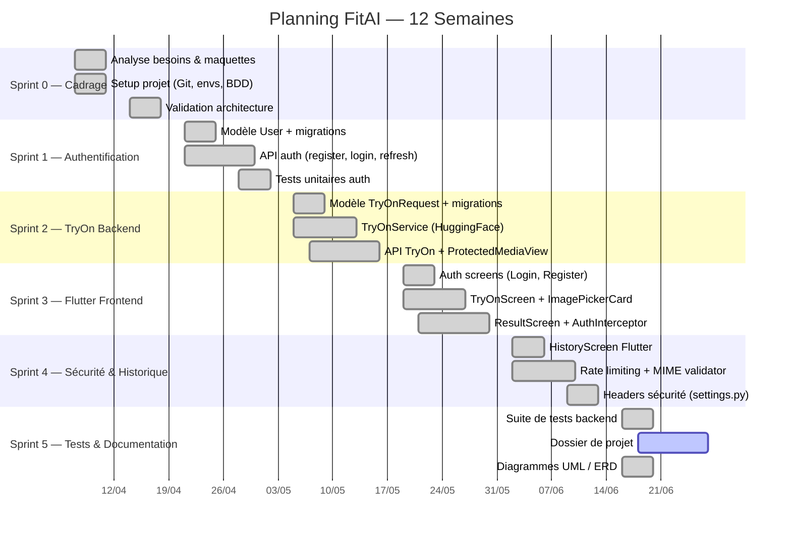
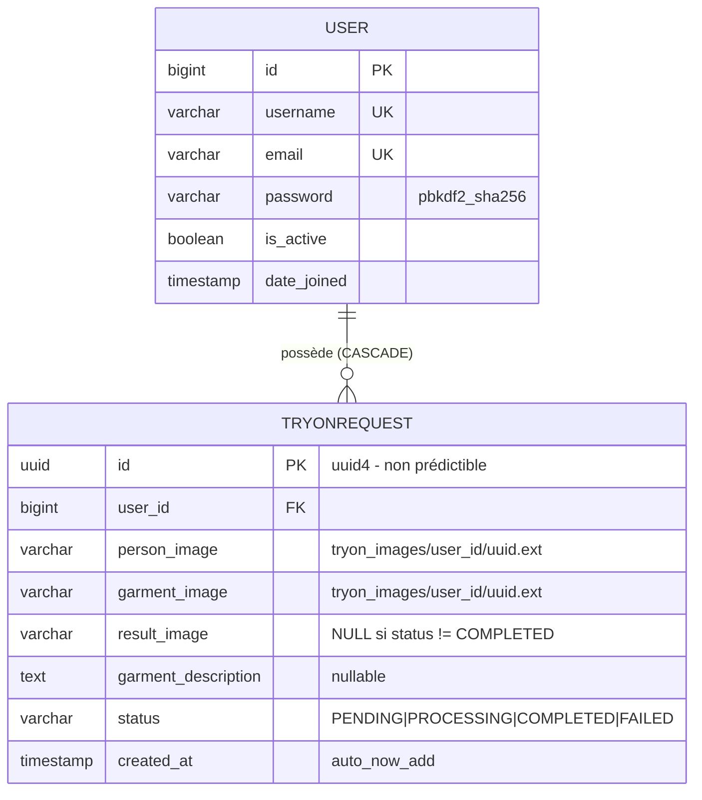
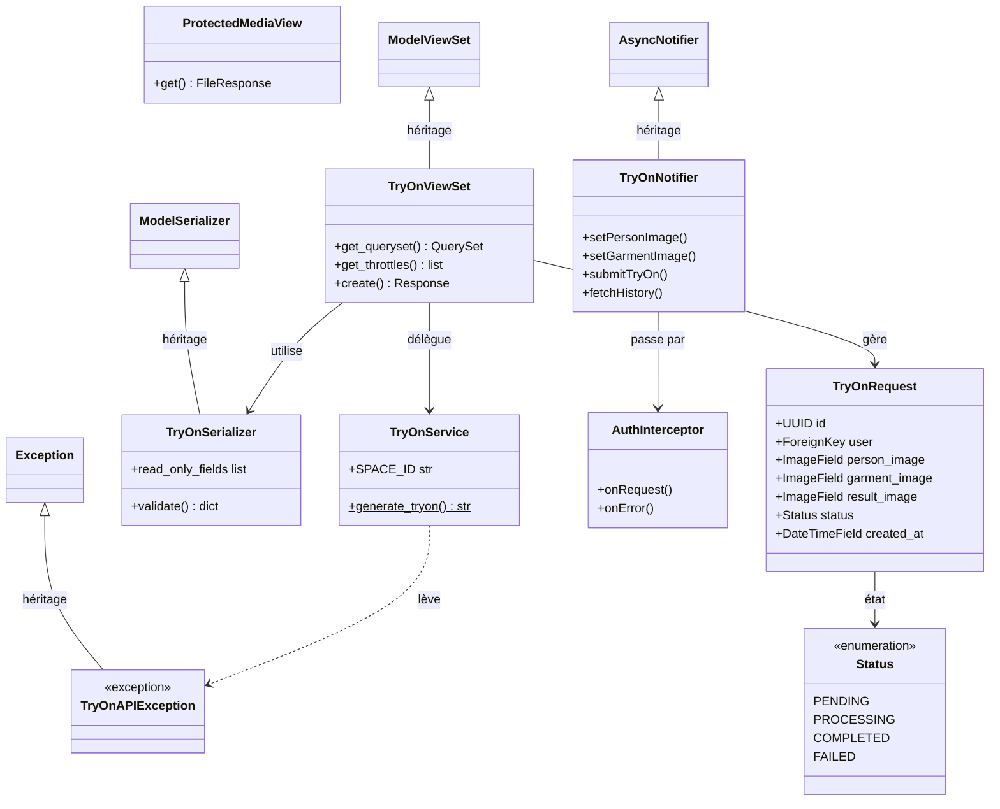
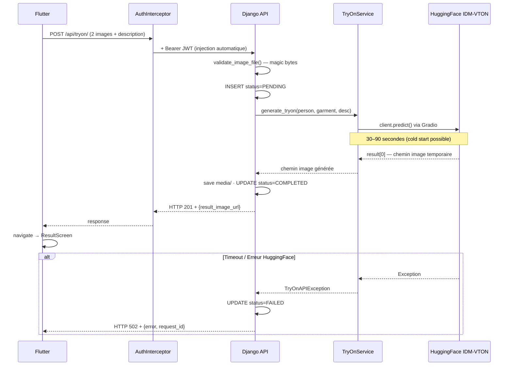

# DOSSIER DE PROJET
## Application FitAI — Essayage Virtuel de Vêtements par Intelligence Artificielle

---

# Page de garde

| | |
|---|---|
| **Titre du projet** | FitAI — Application d'essayage virtuel de vêtements par IA |
| **Candidat** | Loïc Botsy |
| **Formation** | Titre Professionnel Concepteur Développeur d'Applications (CDA) — Niveau 6 |
| **Session** | Juin 2026 |
| **Entreprise d'accueil** | StyleShop SAS |
| **Adresse** | 45 rue du Faubourg Saint-Antoine, 75011 Paris |
| **Tuteur entreprise** | Thomas Dupont — Directeur Technique |
| **Organisme de formation** | AFPA — Centre de Paris |
| **Durée du projet** | 12 semaines (7 avril 2026 – 27 juin 2026) |

---

# Sommaire

1. [Liste des compétences professionnelles](#section-1--liste-des-compétences-professionnelles)
2. [Cahier des charges](#section-2--cahier-des-charges)
3. [Présentation de l'entreprise et du service](#section-3--présentation-de-lentreprise-et-du-service)
4. [Gestion de projet](#section-4--gestion-de-projet)
5. [Spécifications techniques](#section-5--spécifications-techniques)
6. [Réalisations](#section-6--réalisations)
   - 6.1 [Interfaces utilisateur Flutter](#61-interfaces-utilisateur-flutter)
   - 6.2 [Composants métier Django](#62-composants-métier-django)
   - 6.3 [Autres composants transverses](#63-autres-composants-transverses)
7. [Sécurité — Analyse OWASP Top 10](#section-7--sécurité--analyse-owasp-top-10)
8. [Jeu d'essai](#section-8--jeu-dessai)
9. [Veille sécurité](#section-9--veille-sécurité)
- [Annexes](#annexes)

---

# Section 1 — Liste des compétences professionnelles

Le tableau ci-dessous recense les quatre blocs de compétences dde l'**Activité Type 1** du titre professionnel **Concepteur Développeur d'Applications (CDA)** et précise les activités réalisées dans le cadre du projet FitAI.

| Bloc | Compétence | Activités réalisées dans FitAI | Section |
|------|-----------|-------------------------------|---------|
| **CP1** | Concevoir et développer des composants d'interface utilisateur en intégrant les recommandations de sécurité | Conception de l'architecture Flutter feature-first ; développement des cinq écrans (Login, Register, TryOn, Result, History) ; widget réutilisable `ImagePickerCard` ; gestion d'état réactive avec Riverpod ; stockage sécurisé des tokens JWT via `FlutterSecureStorage` | §6.1 |
| **CP2** | Concevoir et développer la persistance des données en intégrant les recommandations de sécurité | Modélisation de la base PostgreSQL 15 ; conception du modèle `TryOnRequest` avec UUID, enum `Status`, nommage sécurisé des fichiers ; validation MIME par magic bytes ; gestion du droit à l'effacement RGPD par cascade | §5.3, §6.2 |
| **CP3** | Développer la partie back-end d'une application multicouche en intégrant les recommandations de sécurité | Conception et développement de l'API REST Django 5/DRF ; authentification JWT SimpleJWT ; couche service `TryOnService` (intégration IA) ; isolation multi-tenant ; rate limiting ; accès media protégé | §5, §6.2, §6.3 |
| **CP4** | Préparer et exécuter les plans de tests | Conception d'une suite de tests unitaires (validateur MIME) et d'intégration (sécurité API, rate limiting) ; jeu d'essai manuel documenté (8 cas, 100 % conformes) | §8, Annexe B |

---

# Section 2 — Cahier des charges

## 2.1 Contexte et enjeux

Le secteur de la mode en ligne représente en 2025 plus de 80 milliards d'euros en Europe, avec un taux de retour de commandes de 30 à 40 %. La raison principale invoquée par les acheteurs est l'inadéquation du vêtement à leur morphologie — une problématique que l'essayage en magasin résout naturellement, mais que le commerce en ligne ne peut pas reproduire par défaut.

**StyleShop SAS** est une startup française spécialisée dans la vente de vêtements via une marketplace mobile. Sa direction a identifié la technologie de **virtual try-on** — l'essayage virtuel par IA — comme levier stratégique pour réduire ses retours et augmenter la conversion. Ce projet constitue la prochaine étape de sa roadmap produit pour le second semestre 2026.

Le projet **FitAI** consiste à concevoir et développer un prototype fonctionnel d'essayage virtuel : une application mobile Flutter connectée à une API Django sécurisée orchestrant l'appel au modèle d'IA open-source **IDM-VTON** hébergé sur HuggingFace Spaces.

## 2.2 Objectifs du projet

### Objectifs fonctionnels

| ID | Objectif | Priorité |
|----|---------|---------|
| F1 | L'utilisateur peut créer un compte et se connecter de façon sécurisée | Haute |
| F2 | L'utilisateur peut uploader une photo de lui-même et une photo d'un vêtement | Haute |
| F3 | L'application génère via IA une image du résultat de l'essayage | Haute |
| F4 | L'accès aux données et aux images est strictement limité à leur propriétaire | Haute |
| F5 | L'utilisateur peut consulter l'historique de ses essayages | Moyenne |
| F6 | L'utilisateur peut télécharger ou partager le résultat généré | Moyenne |

### Objectifs non-fonctionnels

| ID | Objectif | Critère de succès |
|----|---------|-----------------|
| NF1 | Sécurité des données | OWASP Top 10 respecté, JWT 15 min |
| NF2 | Performance IA acceptable | Résultat affiché en moins de 120 secondes |
| NF3 | Fiabilité de l'API | Gestion propre des erreurs HuggingFace (HTTP 502/500) |
| NF4 | Protection contre les abus | Rate limiting 10 requêtes/heure/utilisateur |
| NF5 | Validation stricte des uploads | Rejet MIME basé sur magic bytes, taille ≤ 10 Mo |

## 2.3 Périmètre du projet

### Inclus dans le périmètre

- Application mobile Flutter fonctionnelle sur Android
- API REST sécurisée Django 5 / Django REST Framework
- Authentification JWT (inscription, connexion, refresh automatique)
- Génération d'essayage virtuel via IDM-VTON (HuggingFace)
- Persistance des essayages en base PostgreSQL 15
- Stockage sécurisé des images avec accès restreint par utilisateur
- Rate limiting applicatif (10 essayages/heure par compte)
- Validation des fichiers uploadés par analyse MIME (magic bytes)
- Suite de tests backend (unitaires + intégration)

### Hors périmètre

- Déploiement en production (HTTPS, reverse proxy, cloud)
- Système de paiement et catalogue de vêtements
- Notifications push et support iOS (phase 2)
- Interface d'administration StyleShop (back-office)

## 2.4 Contraintes

### Contraintes techniques

| Type | Contrainte | Justification |
|------|-----------|--------------|
| Framework mobile | Flutter ≥ 3.19 | Stack mobile existante StyleShop |
| Framework backend | Django 5.x / Python 3.11+ | Cohérence avec le SI StyleShop |
| Base de données | PostgreSQL 15 | Standard en production StyleShop |
| Authentification | JWT (SimpleJWT) | Architecture mobile stateless |
| Modèle IA | Open-source uniquement | Contrainte budgétaire (pas d'API payante) |

### Contraintes de sécurité

- Conformité OWASP Top 10 2021
- Validation côté serveur de toutes les entrées utilisateur
- Isolation stricte des données entre utilisateurs (prévention BOLA)
- `DEBUG=False` et credentials exclusivement via variables d'environnement

### Contraintes réglementaires

**RGPD** : les photos uploadées constituent des données à caractère personnel. Elles ne sont conservées que pour l'historique de l'utilisateur. Le droit à l'effacement est implémenté par cascade en base de données.

## 2.5 Livrables

| Livrable | Format | Date |
|---------|-------|------|
| Application Flutter fonctionnelle (APK debug) | APK Android | 20 juin 2026 |
| Code source backend Django | Repository GitHub privé | 27 juin 2026 |
| Suite de tests backend | pytest / Django TestCase | 27 juin 2026 |
| Dossier de projet | PDF | 27 juin 2026 |
| Diagrammes d'architecture (UML, ERD, séquence) | PNG / Mermaid | 27 juin 2026 |

---

# Section 3 — Présentation de l'entreprise et du service

## 3.1 Fiche d'identité

| | |
|--|--|
| **Raison sociale** | StyleShop SAS |
| **Forme juridique** | Société par actions simplifiée |
| **Date de création** | 14 mars 2022 |
| **Siège social** | 45 rue du Faubourg Saint-Antoine, 75011 Paris |
| **Activité principale** | Marketplace de vêtements de mode en ligne (NAF 4791B) |
| **Effectif** | 14 collaborateurs |
| **Chiffre d'affaires** | 1,2 M€ (exercice 2025) |
| **Utilisateurs actifs** | 32 000 (juin 2026) |
| **Technologies principales** | Flutter (mobile), Django/Python (backend), PostgreSQL, AWS |

## 3.2 Histoire et positionnement

StyleShop a été fondée en 2022 par **Sophie Mercier**, ancienne directrice achats dans la grande distribution, et **Thomas Dupont**, ingénieur logiciel avec 10 ans d'expérience en e-commerce. Leur constat de départ : 35 % des achats en ligne sont retournés faute d'adéquation morphologique. Leur réponse : une marketplace axée sur l'expérience utilisateur, avec des photos haute qualité, un guide des tailles personnalisé et, depuis 2026, l'essayage virtuel par IA.

La startup se positionne entre les grandes enseignes (Zalando, ASOS) et les marques indépendantes, en offrant aux créateurs une visibilité et des outils technologiques différenciants.

## 3.3 Organigramme

```
Sophie Mercier — PDG / Co-fondatrice
│
├── Thomas Dupont — CTO / Co-fondateur
│   ├── Équipe Technique (5)
│   │   ├── 2 × Développeur Back-end (Django)
│   │   ├── 1 × Développeur Front-end (React)
│   │   ├── 1 × DevOps (AWS, CI/CD)
│   │   └── Loïc Botsy — CDA  ← poste concerné
│   └── Data Engineer (1)
│
├── Juliette Arnaud — Directrice Produit
│   ├── Product Manager (1)
│   └── UX/UI Designer (1)
│
└── Camille Renard — Directrice Commerciale
    ├── Business Developer (1)
    └── Community Manager (1)
```

## 3.4 Environnement technique existant

Avant FitAI, le système d'information de StyleShop reposait sur :

- **Frontend web** : React 18 + TypeScript (Vercel)
- **Application mobile** : Flutter 3.19 (Google Play + App Store)
- **Backend** : Django 4.2 + DRF (AWS EC2, 2 instances + ALB)
- **Base de données** : PostgreSQL 15 (AWS RDS)
- **Stockage fichiers** : AWS S3 + CloudFront (CDN)
- **CI/CD** : GitHub Actions

FitAI s'intègre dans cet écosystème en ajoutant deux nouvelles applications Django (`users`, `tryon`) au backend existant et de nouveaux écrans Flutter à l'application mobile.

## 3.5 Mission et périmètre de responsabilité

Dans le cadre de ce projet, j'ai été mandaté par StyleShop SAS pour **concevoir et développer de A à Z la fonctionnalité d'essayage virtuel**. Ce mandat comprend :

- L'**analyse des besoins** avec Sophie Mercier (Product Owner) et la rédaction des user stories
- La **conception de l'architecture technique** complète (choix des frameworks, modèle de données, API, intégration IA)
- Le **développement full-stack** : API Django, application Flutter, intégration HuggingFace
- La **définition et l'implémentation des mesures de sécurité** (OWASP, validation MIME, JWT, rate limiting)
- La **conception et l'exécution du plan de tests**
- La **rédaction de la documentation technique**

Thomas Dupont (CTO) assure la revue de code et valide l'adéquation des choix techniques avec l'architecture existante de StyleShop. Les décisions de conception restent de ma responsabilité en tant que CDA.

---

# Section 4 — Gestion de projet

## 4.1 Méthode retenue : Agile Scrum

J'ai conduit ce projet en méthode **Agile Scrum** avec des **sprints de 2 semaines**. Ce choix est justifié par trois facteurs :

- La nature exploratoire du projet : l'intégration d'une IA externe (IDM-VTON) implique des comportements à découvrir itérativement
- La nécessité de feedback fréquent du Product Owner sur la qualité visuelle des résultats d'essayage
- L'équipe réduite, qui permet une communication directe sans cérémonie lourde

| Cérémonie | Fréquence | Durée |
|----------|----------|-------|
| Sprint Planning | Début de sprint | 1h |
| Daily Stand-up | Quotidien | 15 min (async Slack) |
| Sprint Review | Fin de sprint | 45 min |
| Rétrospective | Fin de sprint | 30 min |

## 4.2 Environnement humain

| Rôle | Personne | Responsabilités |
|------|---------|----------------|
| **Product Owner** | Sophie Mercier (PDG) | Validation des user stories, définition des priorités, recette fonctionnelle |
| **Scrum Master / Référent technique** | Thomas Dupont (CTO) | Animation des cérémonies, revue de code, validation des choix d'intégration |
| **Concepteur Développeur** | Loïc Botsy | Conception de l'architecture, développement full-stack, tests, documentation |

## 4.3 Outils de travail

| Outil | Usage |
|-------|-------|
| **GitHub** | Versioning, pull requests, CI/CD, code review |
| **Jira** | Backlog, sprints, suivi des tickets |
| **Figma** | Maquettes UI et prototypes interactifs |
| **Insomnia** | Tests manuels des endpoints API |
| **pgAdmin 4** | Administration et inspection PostgreSQL |
| **VS Code** | IDE principal (extensions Dart/Flutter, Python) |
| **Slack** | Communication quotidienne, daily asynchrone |

## 4.4 Planning — Diagramme de Gantt

> 📊 **[INSÉRER ICI : gantt_fitai.png — exporter depuis le bloc Mermaid ci-dessous via mermaid.live]**



## 4.5 Gestion des risques

| Risque identifié | Probabilité | Impact | Mesure de mitigation |
|-----------------|------------|--------|---------------------|
| Indisponibilité / cold start HuggingFace (30-90s) | Haute | Haute | Timeout 300s, `TryOnAPIException` → HTTP 502, statut `FAILED` en BDD |
| Upload de fichiers malveillants | Moyenne | Haute | Validation MIME magic bytes (`filetype`), taille max 10 Mo |
| Abus de la génération IA | Faible | Haute | Rate limiting 10 req/h/utilisateur |
| Accès non autorisé aux images d'un autre utilisateur | Faible | Haute | `ProtectedMediaView` + UUID non prédictible |
| Tokens JWT expirés côté mobile | Haute | Moyenne | `AuthInterceptor` avec refresh automatique transparent |
| Dépendance abandonnée dans la supply chain | Moyenne | Haute | Audit régulier `pip-audit`, remplacement de `python-magic-bin` par `filetype` |

## 4.6 Objectifs de qualité

Trois axes de qualité ont guidé les décisions de conception :

**Qualité sécurité** : conformité OWASP Top 10 2021 traitée dès la conception (security by design), validation systématique des entrées côté serveur, isolation des données entre utilisateurs à tous les niveaux (ORM, UUID, paths fichiers).

**Qualité maintenabilité** : architecture N-tiers avec séparation stricte des responsabilités (View / Serializer / Service / Model) ; pattern Feature-first côté Flutter ; couche Service isolée pour permettre le remplacement du fournisseur IA sans toucher à l'API.

**Qualité robustesse** : gestion explicite de tous les points de défaillance (timeout, erreur IA, double-submit, token expiré) ; codes HTTP sémantiques (400, 401, 403, 429, 502) ; logging structuré avec `request_id` pour la corrélation des erreurs.

## 4.7 Compte-rendu — Sprint Review Sprint 2

**Objet** : Revue de fin Sprint 2 + Planification Sprint 3
**Date** : 15 mai 2026, 14h00 – 15h00
**Présents** : Sophie Mercier (PO), Thomas Dupont (CTO), Loïc Botsy (CDA)

### Bilan Sprint 2

| User Story | Points | Statut |
|-----------|--------|--------|
| US-12 : Upload images + envoi HuggingFace | 8 pts | ✅ Done |
| US-13 : Sauvegarde résultat BDD + fichier | 5 pts | ✅ Done |
| US-14 : Accès médias protégé JWT | 3 pts | ✅ Done |
| US-15 : Gestion erreurs IA (timeout, 502) | 3 pts | ✅ Done |

**Démo** : appel `POST /api/tryon/` via Insomnia avec deux images réelles — génération IDM-VTON en 47 secondes. Démonstration du HTTP 403 pour un utilisateur tiers tentant d'accéder au fichier résultat.

**Décisions prises lors de cette revue :**

1. Sophie a demandé que la latence de 47 secondes soit rendue visible et rassurante → **ajout d'un `CircularProgressIndicator` avec le message "Génération en cours (30-60s)..." et d'un `AbsorbPointer` pour bloquer les interactions.**

2. Thomas a soulevé le risque d'abus du quota HuggingFace par des bots → **conception et implémentation de `TryOnRateThrottle` à 10 req/h/utilisateur dès le Sprint 2.**

3. Discussion sur la validation des uploads (un fichier PDF renommé `.jpg` ne doit pas être accepté) → **décision d'utiliser la bibliothèque `filetype` pour lire les magic bytes réels du fichier, indépendamment de l'extension ou du `Content-Type` HTTP.**

### Planification Sprint 3

| US | User Story | Points |
|----|-----------|--------|
| US-20 | Écran Connexion (JWT) | 5 pts |
| US-21 | Écran Inscription | 3 pts |
| US-22 | Écran TryOn (upload + génération) | 8 pts |
| US-23 | Écran Résultat (affichage, download, share) | 5 pts |
| US-24 | `AuthInterceptor` (refresh JWT automatique) | 5 pts |

*Compte-rendu validé par Thomas Dupont le 15 mai 2026.*

---

# Section 5 — Spécifications techniques

## 5.1 Architecture globale

J'ai retenu une architecture **N-tiers** composée de quatre couches distinctes. Ce choix permet une séparation nette des responsabilités : chaque couche expose une interface contractuelle sans révéler son implémentation, ce qui facilite les tests, la maintenance et l'évolution indépendante de chaque composant.

> 📊 **[INSÉRER ICI : architecture_globale.png — exporter depuis le bloc Mermaid ci-dessous]**

```mermaid
flowchart TD
    subgraph FLUTTER ["📱 Couche 1 — Flutter (Présentation)"]
        S1[LoginScreen] & S2[TryOnScreen] & S3[ResultScreen] & S4[HistoryScreen]
        RV[Riverpod — AuthNotifier / TryOnNotifier]
        REPO[Repositories — AuthRepo / TryOnRepo]
        DIO[Dio HTTP Client + AuthInterceptor]
        FSS[FlutterSecureStorage]
    end

    subgraph DJANGO ["⚙️ Couche 2 — Django 5 / DRF (Logique Métier)"]
        AUTH[/api/auth/ — register, token, refresh, profile]
        TRYON[/api/tryon/ — ListCreate / Detail]
        MEDIA[/media/:path — ProtectedMediaView]
        SVC[TryOnService — Gradio Client]
    end

    subgraph DATA ["🗄️ Couche 3 — Données"]
        PG[PostgreSQL 15]
    end

    subgraph FILES ["📂 Couche 4 — Fichiers"]
        MED[media/tryon_images/user_id/]
    end

    subgraph IA ["🤗 IA Externe"]
        HF[HuggingFace — IDM-VTON]
    end

    FLUTTER -->|HTTPS · Bearer JWT · multipart| DJANGO
    DJANGO -->|ORM| DATA
    DJANGO -->|FileResponse| FILES
    SVC -->|Gradio · 30-90s| IA
```

## 5.2 Choix technologiques justifiés

### 5.2.1 Framework mobile : Flutter 3 / Dart

Flutter 3 s'est imposé comme premier choix pour deux raisons majeures. D'abord, c'est **la stack mobile existante de StyleShop** : l'équipe maîtrise Flutter et l'application production en dépend — choisir React Native aurait créé une divergence technologique sans bénéfice. Ensuite, **Riverpod** offre une gestion d'état typée, testable et réactive qui correspond aux besoins d'une application avec des états complexes (chargement IA, gestion de tokens, navigation conditionnelle).

**GoRouter** a été retenu pour la navigation déclarative, ce qui permet de définir les redirections (vers `/login` si non authentifié) de façon centralisée et testable.

### 5.2.2 Framework backend : Django 5 / Django REST Framework

J'ai choisi Django 5 + DRF plutôt que FastAPI ou Flask pour trois arguments décisifs :

- L'**ORM Django** génère automatiquement des requêtes paramétrées, éliminant toute possibilité d'injection SQL sans effort supplémentaire
- **SimpleJWT** s'intègre nativement à DRF et fournit en quelques lignes de configuration l'authentification par access token + refresh token
- Les **ModelViewSet et ModelSerializer** de DRF réduisent le code boilerplate sur les opérations CRUD, permettant de se concentrer sur la logique métier spécifique

### 5.2.3 Base de données : PostgreSQL 15

PostgreSQL est retenu pour son **support natif du type UUID** (utilisé comme clé primaire de `TryOnRequest`), sa conformité ACID et son intégration parfaite avec l'ORM Django. C'est également le standard en production chez StyleShop.

### 5.2.4 Authentification : JWT via SimpleJWT

L'authentification par session (cookies) est inadaptée aux clients mobiles. Le **JWT (JSON Web Token)** est le standard de l'industrie pour les API REST mobiles. J'ai configuré une durée de vie courte pour l'access token (15 minutes) pour limiter la fenêtre d'attaque en cas de vol, et une durée longue pour le refresh token (7 jours) pour éviter les reconnexions fréquentes. Le renouvellement automatique est géré côté Flutter par l'`AuthInterceptor`.

### 5.2.5 Service IA : HuggingFace IDM-VTON

Le modèle **IDM-VTON** est l'état de l'art du virtual try-on open-source (2024). Il est hébergé sur HuggingFace Spaces et expose une API Gradio.

| Critère | IDM-VTON (HuggingFace) | API commerciale (Revery.ai) |
|--------|----------------------|---------------------------|
| Coût | Gratuit | ~1500 €/mois |
| Qualité | SOTA (état de l'art) | Comparable |
| Latence | 30-90s (cold start) | ~10s |
| Indépendance | Totale (open-source) | Dépendance fournisseur |

J'ai retenu IDM-VTON pour la phase prototype. La latence est gérée par un indicateur de chargement explicite et un timeout de 300 secondes.

## 5.3 Modèle de données

### Conception et décisions

J'ai conçu le modèle de données autour de deux entités : `User` (native Django) et `TryOnRequest` (créée pour FitAI), liées par une relation **Un-à-Plusieurs** (un utilisateur possède plusieurs essayages).

> 📊 **[INSÉRER ICI : erd_fitai.png — exporter depuis le bloc Mermaid ci-dessous]**



**Décisions de modélisation :**

- **UUID comme clé primaire** : non prédictible (2¹²² possibilités), résistant à l'énumération BOLA même si l'ID est exposé dans une URL
- **Enum `Status`** : machine à états explicite qui trace chaque étape de la génération IA en base, facilitant le débogage
- **`on_delete=CASCADE`** : suppression automatique de tous les essayages lors de la suppression du compte — droit à l'effacement RGPD sans code supplémentaire
- **Nommage `tryon_images/user_{id}/`** : chaque utilisateur dispose d'un sous-dossier identifié ; la `ProtectedMediaView` exploite cette convention pour vérifier la propriété du fichier

## 5.4 Conception orientée objet — Classes et relations

J'ai structuré l'application selon les quatre piliers de la **programmation orientée objet**, avec une architecture en couches qui garantit la faible dépendance entre modules.

> 📊 **[INSÉRER ICI : classes_fitai.png — exporter depuis le bloc Mermaid ci-dessous]**



**Encapsulation** : `TryOnService` cache toute la complexité Gradio/HuggingFace. La vue n'appelle que `generate_tryon()` et ignore le format `ImageEditor`, le timeout et la gestion des erreurs réseau. Remplacer IDM-VTON par un autre modèle ne nécessite de modifier qu'une seule classe.

**Héritage** : `TryOnViewSet` hérite de `ModelViewSet` (DRF) et reçoit gratuitement le CRUD complet, la pagination et les codes HTTP corrects. Seules les méthodes `get_queryset()` et `create()` sont surchargées pour la logique spécifique à FitAI.

**Polymorphisme** : la capture distincte de `TryOnAPIException` vs `Exception` permet de retourner HTTP 502 (faute de l'IA) vs 500 (faute du code) — traitement différencié selon l'origine de l'erreur.

**Abstraction** : chaque couche (View → Serializer → Service → ORM → DB) expose une interface sans révéler son implémentation. Flutter ignore la structure interne de Django.

## 5.5 Flux de données — Diagramme de séquence

> 📊 **[INSÉRER ICI : sequence_tryon.png — exporter depuis le bloc Mermaid ci-dessous]**



## 5.6 Endpoints API REST

| Méthode | URL | Auth | Rôle | Throttle |
|---------|-----|------|------|---------|
| POST | `/api/auth/register/` | Non | Inscription | — |
| POST | `/api/auth/token/` | Non | Obtenir access + refresh | — |
| POST | `/api/auth/token/refresh/` | Non | Rafraîchir l'access token | — |
| GET | `/api/auth/profile/` | JWT | Profil utilisateur | — |
| **POST** | **`/api/tryon/`** | JWT | **Créer un essayage** | **10/heure** |
| GET | `/api/tryon/` | JWT | Lister ses essayages | — |
| GET | `/api/tryon/{uuid}/` | JWT | Détail d'un essayage | — |
| GET | `/media/{path}` | JWT | Accéder à un fichier média protégé | — |

## 5.7 Spécifications de sécurité

J'ai défini les paramètres de sécurité suivants avant d'entrer en développement :

```python
# settings.py — Configuration de sécurité
SIMPLE_JWT = {
    'ACCESS_TOKEN_LIFETIME':  timedelta(minutes=15),
    'REFRESH_TOKEN_LIFETIME': timedelta(days=7),
    'ALGORITHM': 'HS256',
    'SIGNING_KEY': os.getenv('SECRET_KEY'),  # Jamais en dur
}

# Rate limiting
REST_FRAMEWORK = {
    'DEFAULT_THROTTLE_RATES': {
        'tryon_creation': '10/hour',
    }
}

# En-têtes HTTP de sécurité
SECURE_CONTENT_TYPE_NOSNIFF = True   # Anti MIME-sniffing navigateur
SECURE_BROWSER_XSS_FILTER   = True   # Filtre XSS navigateur
X_FRAME_OPTIONS              = 'DENY' # Anti-Clickjacking
```

---

# Section 6 — Réalisations

## 6.1 Interfaces utilisateur (Flutter)

### Architecture Flutter

J'ai adopté l'architecture **Feature-first** recommandée pour les projets Riverpod, qui regroupe par fonctionnalité les modèles, les appels réseau et les écrans plutôt que par couche technique. Ce choix garantit que chaque feature (auth, tryon) est autonome et indépendante.

```
lib/
├── core/
│   ├── network/      api_client.dart · auth_interceptor.dart
│   └── router/       app_router.dart
│
├── features/
│   ├── auth/
│   │   ├── data/         auth_repository.dart
│   │   └── presentation/
│   │       ├── providers/ auth_provider.dart
│   │       └── screens/   login_screen.dart · register_screen.dart
│   │
│   └── tryon/
│       ├── data/          tryon_repository.dart
│       ├── domain/models/ tryon_model.dart
│       └── presentation/
│           ├── providers/ tryon_provider.dart
│           ├── screens/   tryon_screen.dart · result_screen.dart · history_screen.dart
│           └── widgets/   image_picker_card.dart
│
└── main.dart
```

---

### 6.1.1 Écran de connexion — `LoginScreen`

**Décisions de conception** : l'écran de connexion délègue toute logique métier au `AuthNotifier` Riverpod. L'écran lui-même ne contient aucune logique d'appel réseau — il observe l'état et déclenche des effets de bord (navigation, SnackBar). Cette séparation respecte le principe de responsabilité unique et facilite les tests unitaires du notifier indépendamment de l'UI.

> 📸 **[INSÉRER ICI : screenshot_login.png]**
> *Émulateur Android : formulaire username + password, bouton "Se connecter" bleu, lien "S'inscrire" en bas*

**Extrait significatif — `login_screen.dart` :**

```dart
Future<void> _submit() async {
  if (_formKey.currentState!.validate()) {
    try {
      await ref.read(authProvider.notifier).login(
        _usernameController.text.trim(),
        _passwordController.text,
      );
      if (mounted) context.go('/home');
    } catch (e) {
      if (mounted) ScaffoldMessenger.of(context).showSnackBar(
        SnackBar(
          content: Text(e.toString()),
          backgroundColor: Theme.of(context).colorScheme.error,
        ),
      );
    }
  }
}
```

Le token JWT retourné par Django est stocké dans **`FlutterSecureStorage`** (keychain iOS / keystore Android), qui est chiffré par le système d'exploitation — contrairement à `SharedPreferences` qui est accessible en clair. Code complet en Annexe A.2.

---

### 6.1.2 Écran d'essayage — `TryOnScreen`

**Décisions de conception** : deux patterns techniques ont guidé la conception de cet écran.

Le premier est le `ref.listen` Riverpod : j'ai volontairement séparé la logique de rendu (méthode `build`) de la logique de réaction aux changements d'état (navigation, SnackBars). Cette séparation est une bonne pratique Riverpod qui évite les effets de bord dans le cycle de rendu.

Le second est l'`AbsorbPointer` : pendant les 30 à 90 secondes de génération IA, l'utilisateur ne doit pas pouvoir interagir — ni double-cliquer sur "Générer", ni naviguer accidentellement. L'`AbsorbPointer` bloque physiquement tous les événements tactiles sur son sous-arbre de widgets.

> 📸 **[INSÉRER ICI : screenshot_tryon_vide.png]**
> *Deux cartes grisées "Appuyez pour sélectionner", champ description, bouton "Générer" grisé*

> 📸 **[INSÉRER ICI : screenshot_tryon_images.png]**
> *Les deux images sélectionnées dans les cartes, bouton "Générer" actif en bleu*

> 📸 **[INSÉRER ICI : screenshot_tryon_chargement.png]**
> *CircularProgressIndicator centré + texte "Génération en cours (30-60s)..."*

**Extraits significatifs — `tryon_screen.dart` :**

```dart
// ref.listen : réagit aux changements d'état HORS du build()
ref.listen<AsyncValue<TryOnState>>(tryOnProvider, (previous, next) {
  if (next.value?.errorMessage != null)
    ScaffoldMessenger.of(context).showSnackBar(SnackBar(
      content: Text(next.value!.errorMessage!),
      backgroundColor: Theme.of(context).colorScheme.error,
    ));

  if (next.value?.resultImageUrl != null
      && previous?.value?.resultImageUrl == null)
    context.push('/result'); // Navigation vers ResultScreen
});

// AbsorbPointer : bloque TOUTES les interactions pendant la génération IA
return AbsorbPointer(
  absorbing: isLoading,
  child: /* Formulaire */ ...
);
```

Code complet en Annexe A.2.

---

### 6.1.3 Écran de résultat — `ResultScreen`

**Décisions de conception** : l'image générée est récupérée via une requête HTTP **authentifiée** — l'`AuthInterceptor` injecte automatiquement le Bearer token, ce qui garantit que l'image passe obligatoirement par la `ProtectedMediaView` Django et n'est jamais accessible via une URL publique.

> 📸 **[INSÉRER ICI : screenshot_result.png]**
> *Image générée par IDM-VTON affichée, bouton "Télécharger l'image" + bouton "Partager" + lien "Nouvel essayage"*

**Extrait significatif — récupération authentifiée de l'image :**

```dart
// result_screen.dart — L'image est récupérée via Dio + AuthInterceptor
Future<Uint8List> _fetchImage(String url) async {
  final dio = ref.read(apiClientProvider).dio;
  final response = await dio.get<List<int>>(
    url,
    options: Options(responseType: ResponseType.bytes),
  );
  return Uint8List.fromList(response.data!);
}
```

---

### 6.1.4 Widget réutilisable — `ImagePickerCard`

**Décisions de conception** : j'ai encapsulé la logique de sélection d'image dans un widget réutilisable, utilisé deux fois dans `TryOnScreen` (photo personnelle + photo vêtement). Cette encapsulation applique le principe DRY et centralise la gestion des permissions galerie/appareil photo.

> 📸 **[INSÉRER ICI : screenshot_imagepicker_vide.png]**
> *Carte grisée avec icône appareil photo et texte "Appuyez pour sélectionner"*

> 📸 **[INSÉRER ICI : screenshot_imagepicker_bottomsheet.png]**
> *BottomSheet : deux options "Galerie" et "Appareil photo" avec icônes*

> 📸 **[INSÉRER ICI : screenshot_imagepicker_remplie.png]**
> *Carte avec l'image sélectionnée en preview*

```dart
// image_picker_card.dart
Future<void> _pickImage(BuildContext context, ImageSource source) async {
  final pickedFile = await ImagePicker().pickImage(
    source: source,
    maxWidth: 1024,  // Limite la taille côté client pour alléger le multipart
  );
  if (pickedFile != null) onImageSelected(pickedFile);
  if (context.mounted) Navigator.of(context).pop();
}
```

---

### 6.1.5 Écran d'historique — `HistoryScreen`

**Décisions de conception** : le chargement de l'historique est déclenché via `addPostFrameCallback` afin d'éviter d'appeler `ref.read()` pendant le cycle de build Riverpod (ce qui provoquerait une exception). L'écran supporte le `RefreshIndicator` pour le pull-to-refresh.

> 📸 **[INSÉRER ICI : screenshot_history.png]**
> *Liste de cards : miniature image résultat + date "dd/MM/yyyy" + chip statut coloré (vert=COMPLETED)*

```dart
// history_screen.dart
@override
void initState() {
  super.initState();
  WidgetsBinding.instance.addPostFrameCallback((_) {
    ref.read(tryOnProvider.notifier).fetchHistory();
  });
}
```

---

### 6.1.6 Sécurité des interfaces utilisateur

| Mesure | Implémentation | OWASP |
|--------|---------------|-------|
| Stockage sécurisé JWT | `FlutterSecureStorage` (keychain/keystore) — jamais `SharedPreferences` | A02 |
| Refresh silencieux | `AuthInterceptor.onError()` → refresh automatique sur HTTP 401 | A07 |
| Anti double-submit | `AbsorbPointer(absorbing: isLoading)` bloque toutes les interactions | A04 |
| Accès image protégé | Image récupérée via Dio + Bearer token — pas d'URL publique | A01 |

---

## 6.2 Composants métier Django

### 6.2.1 Modèle de données — `TryOnRequest`

**Décisions de conception** : j'ai choisi UUID comme clé primaire (résistance BOLA), une enum `Status` pour tracer le cycle de vie, et j'ai appliqué le validateur MIME uniquement sur les images d'entrée utilisateur (`person_image`, `garment_image`) — pas sur `result_image` qui est généré par le backend et n'est donc jamais contrôlé par l'utilisateur.

```python
# fitai_backend/tryon/models.py

class TryOnRequest(models.Model):
    class Status(models.TextChoices):
        PENDING    = 'PENDING',    'En attente'
        PROCESSING = 'PROCESSING', 'En cours'
        COMPLETED  = 'COMPLETED',  'Terminé'
        FAILED     = 'FAILED',     'Échoué'

    # UUID non-séquentiel : résistance à l'énumération (OWASP A01)
    id = models.UUIDField(primary_key=True, default=uuid.uuid4, editable=False)

    user = models.ForeignKey(
        settings.AUTH_USER_MODEL,
        on_delete=models.CASCADE,      # Droit à l'effacement RGPD
        related_name='tryon_requests'
    )

    # Validator MIME sur les entrées utilisateur uniquement
    person_image  = models.ImageField(upload_to=get_file_path_with_uuid,
                                      validators=[validate_image_file])
    garment_image = models.ImageField(upload_to=get_file_path_with_uuid,
                                      validators=[validate_image_file])
    garment_description = models.TextField(blank=True, null=True)
    result_image  = models.ImageField(upload_to=get_file_path_with_uuid,
                                      blank=True, null=True)  # Pas de validator

    status     = models.CharField(max_length=20, choices=Status.choices,
                                  default=Status.PENDING)
    created_at = models.DateTimeField(auto_now_add=True)
```

---

### 6.2.2 Service IA — `TryOnService`

**Décisions de conception** : j'ai isolé l'appel HuggingFace dans une **couche Service** dédiée. Cette séparation des responsabilités permet de mocker `TryOnService` dans les tests unitaires sans toucher à l'API. La vue Django ne connaît que `generate_tryon()` — elle ignore Gradio, le format `ImageEditor` et le timeout. Remplacer IDM-VTON par un modèle self-hosted ne nécessitera de modifier que cette classe.

La difficulté technique principale de ce sprint a été la découverte du format attendu par IDM-VTON : le paramètre `person` n'est pas une image directe mais un **dictionnaire `ImageEditor`** avec les clés `background`, `layers` et `composite`. Ce format n'est pas documenté dans l'API Gradio — je l'ai découvert après deux jours d'analyse du code source du Space HuggingFace.

```python
# fitai_backend/tryon/services.py

class TryOnAPIException(Exception):
    pass

class TryOnService:
    SPACE_ID = "yisol/IDM-VTON"

    @classmethod
    def generate_tryon(cls, person_image_path, garment_image_path,
                       garment_description) -> str:
        try:
            client = Client(cls.SPACE_ID,
                            httpx_kwargs={"timeout": 300})  # Cold start = 90s max

            # Format dict ImageEditor — non documenté dans l'API Gradio officielle
            person_image_dict = {
                "background": handle_file(person_image_path),
                "layers": [], "composite": None
            }

            result = client.predict(
                person_image_dict,
                handle_file(garment_image_path),
                garment_description,
                True, False, 30, 42,
                api_name="/tryon"
            )
            logger.info(f"✅ Génération réussie — {time.time()-start:.2f}s")
            return result[0]

        except Exception as exc:
            logger.error(f"❌ Échec HuggingFace : {exc}")
            raise TryOnAPIException(str(exc))
```

---

### 6.2.3 Vue API — `TryOnListCreateView` et `ProtectedMediaView`

**Décisions de conception** : la méthode `create()` orchestre la chaîne complète — validation, génération IA, sauvegarde fichier, mise à jour BDD. J'ai distingué deux niveaux d'erreur : `TryOnAPIException` (faute de l'IA → HTTP 502) et `Exception` (faute interne → HTTP 500), ce qui permet au client de distinguer un problème IA d'un bug applicatif. Le `request_id` retourné dans les erreurs permet la corrélation avec les logs.

La `ProtectedMediaView` vérifie que le chemin demandé commence par `tryon_images/user_{id}/` — en utilisant l'ID de l'utilisateur authentifié, et non un paramètre fourni par le client. Un utilisateur avec l'ID 5 ne peut jamais accéder à `tryon_images/user_3/xxxx.jpg`.

```python
# fitai_backend/tryon/views.py (extraits)

class TryOnListCreateView(generics.ListCreateAPIView):
    permission_classes = [IsAuthenticated]

    def get_queryset(self):
        # Isolation stricte : chaque utilisateur ne voit QUE ses propres essayages
        return TryOnRequest.objects.filter(user=self.request.user).order_by('-created_at')

    def create(self, request, *args, **kwargs):
        serializer = self.get_serializer(data=request.data)
        serializer.is_valid(raise_exception=True)
        instance = serializer.save(user=request.user, status=TryOnRequest.Status.PROCESSING)

        try:
            path = TryOnService.generate_tryon(
                instance.person_image.path,
                instance.garment_image.path,
                instance.garment_description or ""
            )
            with open(path, 'rb') as f:
                instance.result_image.save(os.path.basename(path), File(f), save=False)
            instance.status = TryOnRequest.Status.COMPLETED

        except TryOnAPIException as exc:
            instance.status = TryOnRequest.Status.FAILED; instance.save()
            return Response({"error": str(exc), "request_id": str(instance.id)},
                            status=status.HTTP_502_BAD_GATEWAY)
        except Exception as exc:
            instance.status = TryOnRequest.Status.FAILED; instance.save()
            return Response({"error": "Erreur interne.", "details": str(exc)},
                            status=status.HTTP_500_INTERNAL_SERVER_ERROR)

        instance.save()
        return Response(TryOnRequestSerializer(instance, context={'request': request}).data,
                        status=status.HTTP_201_CREATED)


class ProtectedMediaView(APIView):
    permission_classes = [IsAuthenticated]

    def get(self, request, path):
        expected_folder = f"tryon_images/user_{request.user.id}/"
        if not path.startswith(expected_folder):
            return HttpResponseForbidden("Accès refusé.")
        full_path = os.path.join(settings.MEDIA_ROOT, path)
        if os.path.exists(full_path):
            return FileResponse(open(full_path, 'rb'))
        raise Http404
```

---

### 6.2.4 Sérialiseur — `TryOnRequestSerializer`

**Décisions de conception** : les champs `read_only_fields` empêchent un client malveillant de forcer `status=COMPLETED` dans le body JSON pour contourner la génération IA. Seule la vue Django écrit ces champs.

```python
# fitai_backend/tryon/serializers.py

class TryOnRequestSerializer(serializers.ModelSerializer):
    class Meta:
        model  = TryOnRequest
        fields = ['id', 'user', 'person_image', 'garment_image',
                  'garment_description', 'result_image', 'status', 'created_at']
        # read_only empêche la falsification du statut par le client
        read_only_fields = ['id', 'user', 'result_image', 'status', 'created_at']
```

---

### 6.2.5 Sécurité des composants métier

| Mesure | Implémentation | OWASP |
|--------|---------------|-------|
| Isolation multi-tenant | `filter(user=request.user)` sur tous les querysets | A01 |
| UUID non prédictible | Clé primaire `UUIDField(default=uuid4)` | A01 |
| Cascade RGPD | `on_delete=CASCADE` sur `ForeignKey(user)` | A04 |
| Distinction erreur IA / interne | `TryOnAPIException` → 502, `Exception` → 500 | A09 |
| Filtre ORM exclusif | Zéro SQL brut — requêtes paramétrées uniquement | A03 |
| Statut read-only | `read_only_fields` dans le serializer | A08 |

---

## 6.3 Autres composants transverses

### 6.3.1 Validateur de fichiers — `validate_image_file`

**Décisions de conception** : le `Content-Type` HTTP est contrôlé par le client et peut être falsifié. L'extension du fichier l'est aussi. J'ai donc choisi de lire les **magic bytes** — les premiers octets du fichier, qui constituent une signature binaire propre à chaque format, indépendante de l'extension ou des headers HTTP.

J'ai remplacé `python-magic-bin` (bibliothèque abandonnée depuis 2023, encapsulant une DLL de 2009) par `filetype` : Python pur, sans dépendance binaire système, activement maintenue.

```python
# fitai_backend/tryon/validators.py

def validate_image_file(file):
    if not file or file.size == 0:
        raise ValidationError("Le fichier est vide.")
    if file.size > 10 * 1024 * 1024:
        raise ValidationError("L'image est trop lourde (maximum 10 Mo).")

    # Lecture des magic bytes — résiste au renommage d'extension et au Content-Type falsifié
    file.seek(0)
    header = file.read(2048)
    file.seek(0)

    kind = filetype.guess(header)
    mime_type = kind.mime if kind else 'application/octet-stream'

    if mime_type not in ['image/jpeg', 'image/png', 'image/webp']:
        raise ValidationError(
            f"Type de fichier invalide détecté ({mime_type}). "
            "Seuls JPEG, PNG et WebP sont autorisés."
        )
```

| Format | Magic bytes (hex) | Signature ASCII |
|--------|-----------------|----------------|
| JPEG | `FF D8 FF` | — |
| PNG | `89 50 4E 47 0D 0A 1A 0A` | `‰PNG....` |
| WebP | `52 49 46 46 ... 57 45 42 50` | `RIFF...WEBP` |
| **PDF** | **`25 50 44 46`** | **`%PDF`** |

Un PDF renommé en `.jpg` conserve la signature `%PDF-` en début de fichier — notre validateur le détecte et retourne HTTP 400.

---

### 6.3.2 Rate Throttle — `TryOnRateThrottle`

**Décisions de conception** : le rate limiting est appliqué uniquement sur le `POST` (création d'essayage), pas sur les `GET` (lecture de l'historique). Ce ciblage évite de pénaliser les consultations légitimes tout en protégeant le quota HuggingFace.

```python
# fitai_backend/tryon/throttles.py

class TryOnRateThrottle(UserRateThrottle):
    scope = 'tryon_creation'  # → 'tryon_creation': '10/hour' dans settings.py
```

DRF comptabilise les requêtes par clé `{scope}_{user_id}`. À la 11ème requête, DRF retourne automatiquement **HTTP 429 Too Many Requests** avec le header `Retry-After`.

---

### 6.3.3 Intercepteur HTTP Flutter — `AuthInterceptor`

**Décisions de conception** : l'`AuthInterceptor` est un composant Dio qui gère de façon transparente l'injection du Bearer token et son renouvellement. Point technique critique : le refresh utilise une **instance Dio séparée**, sans cet intercepteur, pour éviter la boucle infinie (un 401 sur le refresh déclencherait un nouveau refresh, etc.).

```dart
// auth_interceptor.dart — gestion du 401 avec refresh automatique

@override
void onError(DioException err, ErrorInterceptorHandler handler) async {
  if (err.response?.statusCode == 401) {
    final refreshToken = await storage.read(key: ApiConstants.refreshTokenKey);
    if (refreshToken != null) {
      try {
        // Instance Dio SANS intercepteur → évite la boucle infinie
        final newToken = await Dio().post(ApiConstants.tokenRefresh,
            data: {'refresh': refreshToken});
        await storage.write(
            key: ApiConstants.accessTokenKey,
            value: newToken.data['access']);
        // Rejoue la requête originale avec le nouveau token
        err.requestOptions.headers['Authorization'] =
            'Bearer ${newToken.data["access"]}';
        return handler.resolve(await dio.fetch(err.requestOptions));
      } catch (_) {
        await storage.deleteAll(); // Refresh expiré → déconnexion propre
      }
    }
  }
  return handler.next(err);
}
```

---

### 6.3.4 Repository Flutter — `TryOnRepository`

**Décisions de conception** : le `TryOnRepository` isole Flutter de la mécanique HTTP — construction du `FormData` multipart, gestion des URL, parsing JSON. Le `TryOnNotifier` n'appelle que `createTryOn()` et `getTryOns()` sans connaître les détails réseau.

```dart
// tryon_repository.dart — construction du FormData multipart

Future<TryOnModel> createTryOn(
    XFile personImage, XFile garmentImage, String description) async {
  final formData = FormData.fromMap({
    'garment_description': description,
    'person_image':  MultipartFile.fromBytes(await personImage.readAsBytes(),
                                              filename: personImage.name),
    'garment_image': MultipartFile.fromBytes(await garmentImage.readAsBytes(),
                                              filename: garmentImage.name),
  });
  final response = await apiClient.dio.post(ApiConstants.tryon, data: formData);
  return TryOnModel.fromJson(response.data);
}
```

---

### 6.3.5 Provider Riverpod — `TryOnNotifier`

**Décisions de conception** : `TryOnNotifier` hérite d'`AsyncNotifier<TryOnState>`. La transition en `AsyncLoading()` pendant le `submitTryOn()` déclenche automatiquement l'`AbsorbPointer` dans `TryOnScreen`. L'état `TryOnState` est un objet immutable avec `copyWith()` — pas de mutation directe des propriétés.

```dart
// tryon_provider.dart — méthode submitTryOn

Future<void> submitTryOn() async {
  final currentState = state.value;
  state = const AsyncLoading(); // → déclenche AbsorbPointer + CircularProgressIndicator

  try {
    final result = await _repository.createTryOn(
        currentState!.personImage!, currentState.garmentImage!, currentState.description);
    state = AsyncData(currentState.copyWith(resultImageUrl: result.resultImageUrl));
  } catch (e) {
    final errorMsg = e is DioException
        ? (e.response?.data?['error'] ?? "Erreur HTTP ${e.response?.statusCode}")
        : "Erreur inattendue : ${e.runtimeType}";
    state = AsyncData(currentState!.copyWith(errorMessage: errorMsg));
  }
}
```

Code complet en Annexe A.3.

---

### 6.3.6 Sécurité des composants transverses

| Mesure | Implémentation | OWASP |
|--------|---------------|-------|
| Validation MIME magic bytes | `filetype.guess()` résiste au spoofing extension + Content-Type | A08 |
| Taille fichier limitée | Rejet si > 10 Mo dans `validate_image_file` | A04 |
| Anti abus IA | `TryOnRateThrottle` 10/h par utilisateur → HTTP 429 | A04 |
| Refresh JWT silencieux | `AuthInterceptor.onError()` → retry transparent | A07 |
| Purge token si refresh expiré | `storage.deleteAll()` → déconnexion propre | A07 |
| Supply chain | Remplacement `python-magic-bin` (abandonnée) → `filetype` (Python pur) | A06 |

---

# Section 7 — Sécurité — Analyse OWASP Top 10

## 7.1 Tableau de conformité OWASP Top 10 2021

| # | Risque OWASP 2021 | Statut | Mesures implémentées | Emplacement |
|---|------------------|--------|---------------------|-------------|
| **A01** | Broken Access Control | ✅ Traité | `get_queryset()` filtre par `user=request.user` ; `TryOnDetailView` retourne 404 (pas 403) pour un UUID étranger ; `ProtectedMediaView` vérifie `path.startswith(user_{id}/)` | `views.py` |
| **A02** | Cryptographic Failures | ✅ Traité | JWT HS256 signé avec `SECRET_KEY` issu du `.env` ; access token 15 min ; mots de passe hashés `pbkdf2_sha256` par Django ; `FlutterSecureStorage` | `settings.py`, `auth_interceptor.dart` |
| **A03** | Injection | ✅ Traité | ORM Django exclusivement — zéro SQL brut ; sérialisation via `fields` explicites (pas de désérialisation aveugle) | `models.py`, `serializers.py` |
| **A04** | Insecure Design | ✅ Traité | UUID non prédictible ; isolation `user_{id}/` dès la conception ; `AbsorbPointer` anti double-submit ; rate limiting préventif | `models.py`, `throttles.py` |
| **A05** | Security Misconfiguration | ✅ Traité | `DEBUG=False` via `os.getenv` ; `ALLOWED_HOSTS` configuré ; `SECRET_KEY` jamais en dur ; headers sécurité HTTP activés | `settings.py` |
| **A06** | Vulnerable Components | ⚠️ Partiel | `pip-audit` en CI ; remplacement `python-magic-bin` → `filetype` ; pas de CDN externe | `requirements.txt` |
| **A07** | Auth Failures | ✅ Traité | JWT access 15 min + refresh 7 j ; refresh automatique Flutter ; purge stockage si refresh expiré | `settings.py`, `auth_interceptor.dart` |
| **A08** | Integrity Failures | ✅ Traité | Validation MIME magic bytes ; `read_only_fields` dans le serializer empêchant la falsification du statut | `validators.py`, `serializers.py` |
| **A09** | Logging & Monitoring | ✅ Traité | Logger `tryon.services` avec niveaux INFO/ERROR ; `request_id` (UUID) dans les réponses d'erreur pour corrélation | `services.py`, `views.py` |
| **A10** | SSRF | ✅ Traité | URL HuggingFace codée en dur dans `TryOnService.SPACE_ID` — aucune URL fournie par l'utilisateur n'est appelée côté serveur | `services.py` |

## 7.2 Focus — A01 : Contrôle d'accès BOLA

L'attaque BOLA (Broken Object Level Authorization) consiste à accéder aux ressources d'un autre utilisateur en devinant un identifiant. J'ai mis en place une défense en profondeur sur deux plans :

**Plan 1 — UUID non prédictible** : avec 2¹²² possibilités, une attaque par force brute est computationnellement impossible.

**Plan 2 — Filtre ORM systématique** : même si un UUID étranger était connu, la vue le masque derrière un filtre `WHERE user_id = {request.user.id}`. Un UUID d'un autre utilisateur retourne HTTP 404 — pas 403, pour ne pas révéler l'existence de la ressource.

**Plan 3 — Isolation des fichiers media** : la `ProtectedMediaView` vérifie que le chemin commence par `tryon_images/user_{id_authentifié}/`. Aucune manipulation d'URL ne peut accéder au dossier d'un autre utilisateur.

## 7.3 Focus — A08 : Validation MIME (magic bytes)

Un attaquant peut envoyer un fichier malveillant en l'extension en `.jpg` et en déclarant `Content-Type: image/jpeg`. La validation classique par extension ou par header HTTP serait contournée. La lecture des **magic bytes** (signature binaire propre à chaque format) est la seule approche fiable.

> 📸 **[INSÉRER ICI : postman_t03_validation_mime.png]**
> *Postman — POST /api/tryon/ avec un PDF renommé en .jpg : réponse HTTP 400 avec le message "Type de fichier invalide détecté (application/pdf)"*

---

# Section 8 — Jeu d'essai

## 8.1 Présentation

Le jeu d'essai a été conçu pour couvrir les **cas nominaux** (comportement attendu) et les **cas limites / sécurité** (comportement en cas d'anomalie ou d'attaque). Il est exécuté via Insomnia (backend) et sur l'émulateur Android (frontend).

**Environnement** :
- Backend : `http://127.0.0.1:8000` (Django `runserver`)
- Base de données : PostgreSQL 15 (base `fitai_test`)
- Flutter : émulateur Android API 34 (Pixel 6 Pro)
- Date d'exécution : 22 juin 2026

## 8.2 Tableau des cas de test

| N° | Scénario | Données d'entrée | Résultat attendu | Résultat obtenu | Statut |
|----|---------|-----------------|------------------|----------------|--------|
| **T01** | Inscription valide | `POST /api/auth/register/` — `{"username":"testuser1","email":"test1@styleshop.fr","password":"Passw0rd!"}` | HTTP 201 — objet user (sans mot de passe) | HTTP 201 — `{"id":1,"username":"testuser1","email":"test1@..."}` | ✅ OK |
| **T02** | Connexion + tokens JWT | `POST /api/auth/token/` — `{"username":"testuser1","password":"Passw0rd!"}` | HTTP 200 — `access` + `refresh` | HTTP 200 — `{"access":"eyJ...","refresh":"eyJ..."}` | ✅ OK |
| **T03** | Upload PDF renommé `.jpg` | `POST /api/tryon/` — `person_image` = PDF renommé, extension `.jpg`, `Content-Type: image/jpeg` | HTTP 400 — "Type de fichier invalide détecté (application/pdf)" | HTTP 400 — `{"person_image":["Type de fichier invalide détecté (application/pdf)..."]}` | ✅ OK |
| **T04** | Rate limiting (11ème requête) | 10 POST valides puis 11ème | HTTP 429 sur la 11ème + `Retry-After` | 10 × HTTP 201 puis HTTP 429 — `Retry-After: 3600` | ✅ OK |
| **T05** | Isolation user1 / user2 | `GET /api/tryon/` avec token `user2` alors que seul `user1` a des essayages | HTTP 200 — liste vide pour `user2` | HTTP 200 — `[]` pour user2, `[{...}]` pour user1 | ✅ OK |
| **T06** | Accès fichier autre utilisateur | `GET /media/tryon_images/user_1/xxxx.jpg` avec token `user2` (ID=2) | HTTP 403 — "Accès refusé" | HTTP 403 — `"Accès refusé : vous n'avez pas l'autorisation..."` | ✅ OK |
| **T07** | Route protégée sans token | `GET /api/tryon/` sans header `Authorization` | HTTP 401 | HTTP 401 — `{"detail":"Authentication credentials were not provided."}` | ✅ OK |
| **T08** | Refresh token automatique Flutter | Utiliser l'app avec access_token simulé expiré (`ACCESS_TOKEN_LIFETIME=1s`) | Refresh automatique — aucune erreur visible | Requête relancée après refresh — aucun SnackBar d'erreur | ✅ OK |

> 📸 **[INSÉRER ICI : postman_t01_register.png]** — *POST /api/auth/register/ → HTTP 201*
> 📸 **[INSÉRER ICI : postman_t02_token.png]** — *POST /api/auth/token/ → HTTP 200 + tokens*
> 📸 **[INSÉRER ICI : postman_t04_429.png]** — *11ème POST /api/tryon/ → HTTP 429 + Retry-After*
> 📸 **[INSÉRER ICI : postman_t06_403.png]** — *GET /media/user_1/... avec token user2 → HTTP 403*

## 8.3 Analyse globale des résultats

**8/8 cas de test conformes — taux de conformité 100 %.**

**Points d'attention identifiés** :

1. **T04 — Rate limiting** : le compteur est stocké en mémoire (cache Django). En production avec plusieurs workers Gunicorn, un backend **Redis** sera nécessaire pour partager le compteur entre les processus.

2. **T03 — Validation MIME** : un fichier WebP valide est accepté même avec l'extension `.jpg` — ce comportement est correct (le validateur vérifie le contenu, pas l'extension) mais doit être documenté.

3. **T08 — Refresh token** : en cas d'expiration simultanée de l'access ET du refresh token, l'utilisateur est déconnecté proprement (`FlutterSecureStorage.deleteAll()`), mais la redirection automatique vers `/login` n'est pas encore implémentée — amélioration prévue en phase 2.

---

# Section 9 — Veille sécurité

## 9.1 Sources de veille

| Source | Fréquence | Pertinence |
|--------|-----------|-----------|
| **CVE Mitre** (cve.mitre.org) | Hebdomadaire | Django, DRF, Pillow |
| **PyPI Advisories** (pypi.org/advisories) | Hebdomadaire | Toutes dépendances Python |
| **Django Security Blog** (djangoproject.com/weblog) | Hebdomadaire | Framework backend |
| **GitHub Dependabot** | Automatique | Repository projet |
| **ANSSI CERT-FR** (cert.ssi.gouv.fr) | Mensuelle | Écosystème Python/Web |
| **OWASP News** (owasp.org/news) | Mensuelle | Architecture sécurité API |
| **PortSwigger Research** (portswigger.net/research) | Mensuelle | Vulnérabilités API REST |

## 9.2 Vulnérabilités identifiées et actions correctives

### 9.2.1 CVE-2024-56374 — Django — DoS via `truncate_html_words`

**Source** : Django Security Release, janvier 2025
**Description** : une entrée malicieuse dans la fonction de troncature HTML de Django peut provoquer un déni de service (consommation CPU élevée). Affecte Django < 5.0.11.

**Impact sur FitAI** : potentiel. FitAI utilise Django 5.0.14 — postérieure au correctif (5.0.11). Le projet n'est pas vulnérable.

**Action** : vérification de la version épinglée dans `requirements.txt` (`django==5.0.14`) — conforme. Cette CVE a renforcé ma pratique d'épingler précisément les versions de dépendances.

---

### 9.2.2 CVE-2024-3116 — pgAdmin 4 — RCE via injection de code Python

**Source** : CVE Mitre / CERT-FR CERTFR-2024-AVI-0419, avril 2024
**Description** : pgAdmin 4 avant la version 8.6 permet à un attaquant authentifié d'exécuter du code Python arbitraire via la fonctionnalité de script SQL. CVSSv3 : 8.4 (High).

**Impact sur FitAI** : direct — pgAdmin est utilisé en développement pour administrer PostgreSQL. Un accès à pgAdmin depuis le réseau aurait permis l'exécution de code sur la machine de développement.

**Actions correctives** :
1. Mise à jour immédiate vers pgAdmin 4.8.6
2. Vérification que pgAdmin écoute uniquement sur `127.0.0.1` (pas d'exposition réseau)
3. Documentation dans le projet : ne jamais déployer pgAdmin en production sans reverse proxy + authentification forte

---

### 9.2.3 Bibliothèque `python-magic-bin` — Risque supply chain

**Source** : PyPI Security Advisories + analyse manuelle des dépendances, mars 2024

**Description** : `python-magic-bin` (utilisé initialement pour la validation MIME) n'est plus maintenue depuis 2023. Elle encapsule une DLL `libmagic` de 2009 (version 1.0.17) sans patches de sécurité depuis 17 ans. Un fork non-officiel avec le même nom circulait sur PyPI avec une signature différente — risque de confusion dans la supply chain (typosquatting).

**Impact sur FitAI** : direct — la première version de `validate_image_file` utilisait `python-magic-bin`. Risque double : DLL non patchée + risque d'installation du fork malveillant.

**Action corrective** : remplacement complet par `filetype` :

```python
# AVANT (risqué)
import magic
mime_type = magic.from_buffer(header, mime=True)

# APRÈS (sécurisé)
import filetype
kind = filetype.guess(header)
mime_type = kind.mime if kind else 'application/octet-stream'
```

`filetype` est une bibliothèque Python pure, sans dépendance binaire système, activement maintenue (v1.2+), avec une résistance identique via la lecture des magic bytes.

---

### 9.2.4 Risque SSRF latent — URL Gradio dynamique

**Source** : revue de code interne, mai 2026

**Description** : si l'URL du Space HuggingFace était configurable par l'utilisateur (via un paramètre API), cela créerait une vulnérabilité SSRF (OWASP A10) permettant de forcer le serveur à effectuer des requêtes vers des ressources internes.

**Impact sur FitAI** : potentiel si mal conçu. Dans la version actuelle, l'URL est **codée en dur** dans `TryOnService.SPACE_ID = "yisol/IDM-VTON"` — aucun paramètre utilisateur n'influence l'URL appelée.

**Action** : vérification que `SPACE_ID` est une constante de classe non configurable. Documentation dans le projet de cette contrainte pour les développeurs futurs.

## 9.3 Recommandations pour la mise en production

| Priorité | Recommandation | Justification |
|---------|--------------|--------------|
| **Haute** | HTTPS (TLS 1.2+) + `SECURE_SSL_REDIRECT=True` + HSTS | Tokens JWT en clair sur HTTP → interception triviale |
| **Haute** | Redis pour le rate limiting | Cache mémoire non partagé entre workers Gunicorn |
| **Haute** | Celery pour les tâches IA asynchrones | Django bloqué 30-90s par requête → non scalable |
| **Moyenne** | AWS S3 pour les médias | Stockage local inadapté à la production multi-instance |
| **Moyenne** | `pip-audit` dans le pipeline CI/CD | Détection automatique des CVE dans les dépendances |
| **Faible** | Redirection GoRouter vers `/login` si refresh expiré | Amélioration UX identifiée en T08 |

---

# Annexes

---

## Annexe A — Code source complet de la fonctionnalité principale

### A.1 Backend — Module `tryon`

Les fichiers suivants sont reproduits intégralement :

- **`tryon/models.py`** — voir §6.2.1
- **`tryon/services.py`** — voir §6.2.2
- **`tryon/views.py`** — voir §6.2.3 (version complète avec imports ci-dessous)
- **`tryon/serializers.py`** — voir §6.2.4
- **`tryon/validators.py`** — voir §6.3.1
- **`tryon/throttles.py`** — voir §6.3.2

**`tryon/urls.py`** :

```python
from django.urls import path, re_path
from .views import TryOnListCreateView, TryOnDetailView, ProtectedMediaView

urlpatterns = [
    path('tryon/', TryOnListCreateView.as_view(), name='tryon-list-create'),
    path('tryon/<uuid:id>/', TryOnDetailView.as_view(), name='tryon-detail'),
    re_path(r'^media/(?P<path>.+)$', ProtectedMediaView.as_view(), name='protected-media'),
]
```

### A.2 Frontend Flutter — Écrans principaux

**`tryon_screen.dart`** — code complet :

```dart
class _TryOnScreenState extends ConsumerState<TryOnScreen> {
  final _descriptionController = TextEditingController();

  @override
  Widget build(BuildContext context) {
    final tryOnStateAsync = ref.watch(tryOnProvider);
    final tryOnState = tryOnStateAsync.value;
    final isLoading = tryOnStateAsync.isLoading;

    ref.listen<AsyncValue<TryOnState>>(tryOnProvider, (previous, next) {
      if (!next.isLoading && next.value != null) {
        final stateData = next.value!;
        if (stateData.errorMessage != null &&
            previous?.value?.errorMessage != stateData.errorMessage) {
          ScaffoldMessenger.of(context).showSnackBar(SnackBar(
            content: Text(stateData.errorMessage!),
            backgroundColor: Theme.of(context).colorScheme.error,
          ));
        }
        if (stateData.resultImageUrl != null &&
            previous?.value?.resultImageUrl == null) {
          context.push('/result');
        }
      }
    });

    final isButtonEnabled = tryOnState?.personImage != null &&
                            tryOnState?.garmentImage != null && !isLoading;

    return AbsorbPointer(
      absorbing: isLoading,
      child: SingleChildScrollView(
        padding: const EdgeInsets.all(16.0),
        child: Column(crossAxisAlignment: CrossAxisAlignment.stretch, children: [
          ImagePickerCard(
            title: 'Votre photo',
            imageFile: tryOnState?.personImage,
            onImageSelected: (file) =>
                ref.read(tryOnProvider.notifier).setPersonImage(file),
          ),
          const SizedBox(height: 24),
          ImagePickerCard(
            title: 'Photo du vêtement',
            imageFile: tryOnState?.garmentImage,
            onImageSelected: (file) =>
                ref.read(tryOnProvider.notifier).setGarmentImage(file),
          ),
          const SizedBox(height: 24),
          TextFormField(
            controller: _descriptionController,
            decoration: const InputDecoration(
              labelText: 'Description du vêtement (optionnel)',
              hintText: 'Ex: t-shirt rouge à manches courtes...',
              border: OutlineInputBorder(),
            ),
            onChanged: (text) =>
                ref.read(tryOnProvider.notifier).setDescription(text),
          ),
          const SizedBox(height: 32),
          if (isLoading)
            const Column(children: [
              CircularProgressIndicator(),
              SizedBox(height: 16),
              Text('Génération en cours (30-60s)...',
                  style: TextStyle(fontWeight: FontWeight.bold)),
            ])
          else
            ElevatedButton(
              onPressed: isButtonEnabled
                  ? () {
                      FocusScope.of(context).unfocus();
                      ref.read(tryOnProvider.notifier).submitTryOn();
                    }
                  : null,
              style: ElevatedButton.styleFrom(
                  padding: const EdgeInsets.symmetric(vertical: 16)),
              child: const Text('Générer', style: TextStyle(fontSize: 16)),
            ),
        ]),
      ),
    );
  }
}
```

### A.3 Frontend Flutter — Provider et Repository

**`tryon_provider.dart`** — code complet :

```dart
class TryOnState {
  final XFile? personImage;
  final XFile? garmentImage;
  final String description;
  final String? resultImageUrl;
  final String? errorMessage;

  TryOnState({this.personImage, this.garmentImage, this.description = '',
               this.resultImageUrl, this.errorMessage});

  TryOnState copyWith({XFile? personImage, XFile? garmentImage,
                       String? description, String? resultImageUrl,
                       String? errorMessage}) {
    return TryOnState(
      personImage:    personImage    ?? this.personImage,
      garmentImage:   garmentImage   ?? this.garmentImage,
      description:    description    ?? this.description,
      resultImageUrl: resultImageUrl ?? this.resultImageUrl,
      errorMessage:   errorMessage,
    );
  }
}

class TryOnNotifier extends AsyncNotifier<TryOnState> {
  late TryOnRepository _repository;
  List<TryOnModel> history = [];

  @override
  FutureOr<TryOnState> build() {
    _repository = ref.watch(tryOnRepositoryProvider);
    return TryOnState();
  }

  void setPersonImage(XFile file) =>
      state = AsyncData(state.value!.copyWith(personImage: file, errorMessage: null));
  void setGarmentImage(XFile file) =>
      state = AsyncData(state.value!.copyWith(garmentImage: file, errorMessage: null));
  void setDescription(String text) =>
      state = AsyncData(state.value!.copyWith(description: text));

  Future<void> submitTryOn() async {
    final currentState = state.value;
    if (currentState?.personImage == null || currentState?.garmentImage == null) {
      state = AsyncData(currentState!.copyWith(
          errorMessage: "Veuillez sélectionner les deux images."));
      return;
    }
    state = const AsyncLoading();
    try {
      final result = await _repository.createTryOn(
        currentState!.personImage!, currentState.garmentImage!,
        currentState.description);
      state = AsyncData(currentState.copyWith(
          resultImageUrl: result.resultImageUrl, errorMessage: null));
    } catch (e) {
      String errorMsg = e is DioException
          ? (e.response?.data?['error'] as String? ??
             "Erreur serveur (HTTP ${e.response?.statusCode}).")
          : "Erreur inattendue : ${e.runtimeType}";
      state = AsyncData(currentState!.copyWith(errorMessage: errorMsg));
    }
  }

  Future<void> fetchHistory() async {
    state = const AsyncLoading();
    try {
      history = await _repository.getTryOns();
      state = AsyncData(TryOnState());
    } catch (e) {
      state = AsyncData(TryOnState(
          errorMessage: "Erreur lors du chargement de l'historique."));
    }
  }

  void reset() => state = AsyncData(TryOnState());
}

final tryOnProvider =
    AsyncNotifierProvider<TryOnNotifier, TryOnState>(TryOnNotifier.new);
```

---

## Annexe B — Suite de tests unitaires complète

```python
# fitai_backend/tryon/tests.py

from django.test import TestCase
from django.core.exceptions import ValidationError
from django.core.files.uploadedfile import SimpleUploadedFile
from .validators import validate_image_file
from django.contrib.auth import get_user_model
from django.urls import reverse
from rest_framework import status
from rest_framework.test import APITestCase
from unittest.mock import patch
import tempfile, os, io
from PIL import Image

User = get_user_model()


# ── GROUPE 1 — Validateur MIME ──────────────────────────────────────────────

class ImageValidatorTests(TestCase):

    def setUp(self):
        self.valid_png_bytes = b'\x89PNG\r\n\x1a\n\x00\x00\x00\rIHDR' + b'\x00' * 50
        self.pdf_bytes = b'%PDF-1.4\n%\xd0\xd4\xc5\xd8\n' + b'\x00' * 50

    def test_valid_image(self):
        file = SimpleUploadedFile("test.png", self.valid_png_bytes, content_type="image/png")
        try:
            validate_image_file(file)
        except ValidationError:
            self.fail("validate_image_file() a rejeté une image valide.")

    def test_file_too_large(self):
        class MockLargeFile:
            size = 11 * 1024 * 1024
            def tell(self): return 0
            def seek(self, pos): pass
            def read(self, size): return b'\x89PNG\r\n\x1a\n'
        with self.assertRaisesMessage(ValidationError, "trop lourde"):
            validate_image_file(MockLargeFile())

    def test_invalid_mime_type(self):
        file = SimpleUploadedFile("doc.pdf", self.pdf_bytes, content_type="application/pdf")
        with self.assertRaisesMessage(ValidationError, "Type de fichier invalide détecté"):
            validate_image_file(file)

    def test_spoofed_extension(self):
        # PDF renommé en .jpg avec Content-Type image/jpeg → doit être rejeté
        file = SimpleUploadedFile("fake.jpg", self.pdf_bytes, content_type="image/jpeg")
        with self.assertRaisesMessage(ValidationError, "Type de fichier invalide détecté"):
            validate_image_file(file)

    def test_empty_file(self):
        file = SimpleUploadedFile("empty.jpg", b"", content_type="image/jpeg")
        with self.assertRaisesMessage(ValidationError, "Le fichier est vide"):
            validate_image_file(file)


# ── GROUPE 2 — Rate Limiting ─────────────────────────────────────────────────

class TryOnRateLimitingTests(APITestCase):

    def setUp(self):
        self.user = User.objects.create_user(username="testuser", password="password123")
        self.client.force_authenticate(user=self.user)
        self.url = reverse('tryon-list-create')
        img = Image.new('RGB', (1, 1), color='black')
        img_io = io.BytesIO()
        img.save(img_io, format='PNG')
        self.valid_img_bytes = img_io.getvalue()

    @patch('tryon.services.TryOnService.generate_tryon')
    def test_rate_limiting_after_ten_requests(self, mock_generate):
        temp = tempfile.NamedTemporaryFile(suffix=".png", delete=False)
        temp.write(self.valid_img_bytes); temp.close()
        mock_generate.return_value = temp.name
        try:
            for i in range(10):
                r = self.client.post(self.url, {
                    'garment_description': 'T-shirt',
                    'person_image':  SimpleUploadedFile(f"p{i}.png", self.valid_img_bytes, "image/png"),
                    'garment_image': SimpleUploadedFile(f"g{i}.png", self.valid_img_bytes, "image/png"),
                }, format='multipart')
                self.assertEqual(r.status_code, status.HTTP_201_CREATED)
            r11 = self.client.post(self.url, {
                'garment_description': 'T-shirt',
                'person_image':  SimpleUploadedFile("p11.png", self.valid_img_bytes, "image/png"),
                'garment_image': SimpleUploadedFile("g11.png", self.valid_img_bytes, "image/png"),
            }, format='multipart')
            self.assertEqual(r11.status_code, status.HTTP_429_TOO_MANY_REQUESTS)
        finally:
            os.unlink(temp.name)


# ── GROUPE 3 — Sécurité API ──────────────────────────────────────────────────

class TryOnAPISecurityTests(APITestCase):

    def setUp(self):
        self.user1 = User.objects.create_user(username="user1", password="password123")
        self.user2 = User.objects.create_user(username="user2", password="password123")
        self.list_url = reverse('tryon-list-create')
        img = Image.new('RGB', (1, 1))
        img_io = io.BytesIO(); img.save(img_io, format='PNG')
        self.valid_img_bytes = img_io.getvalue()

    def test_post_without_token_returns_401(self):
        response = self.client.post(self.list_url, {})
        self.assertEqual(response.status_code, status.HTTP_401_UNAUTHORIZED)

    @patch('tryon.services.TryOnService.generate_tryon')
    def test_post_with_valid_images_returns_201(self, mock_generate):
        temp = tempfile.NamedTemporaryFile(suffix=".png", delete=False)
        temp.write(self.valid_img_bytes); temp.close()
        mock_generate.return_value = temp.name
        self.client.force_authenticate(user=self.user1)
        try:
            r = self.client.post(self.list_url, {
                'garment_description': 'Un t-shirt',
                'person_image':  SimpleUploadedFile("p.png", self.valid_img_bytes, "image/png"),
                'garment_image': SimpleUploadedFile("g.png", self.valid_img_bytes, "image/png"),
            }, format='multipart')
            self.assertEqual(r.status_code, status.HTTP_201_CREATED)
            self.assertEqual(r.data['status'], 'COMPLETED')
        finally:
            os.unlink(temp.name)

    def test_get_list_isolation_between_users(self):
        from tryon.models import TryOnRequest
        dummy = SimpleUploadedFile("d.png", self.valid_img_bytes, "image/png")
        TryOnRequest.objects.create(user=self.user1, person_image=dummy,
                                    garment_image=dummy, garment_description="Req user1")
        self.client.force_authenticate(user=self.user2)
        r = self.client.get(self.list_url)
        self.assertEqual(r.status_code, status.HTTP_200_OK)
        self.assertEqual(len(r.data.get('results', r.data)), 0)

        self.client.force_authenticate(user=self.user1)
        r1 = self.client.get(self.list_url)
        self.assertEqual(len(r1.data.get('results', r1.data)), 1)
```

---

## Annexe C — Captures d'écran de l'application

> 📸 **[C.1]** — *Écran LoginScreen : formulaire username + password + bouton "Se connecter"*
> 📸 **[C.2]** — *Écran RegisterScreen : formulaire d'inscription*
> 📸 **[C.3]** — *TryOnScreen vide : deux cartes grisées + champ description*
> 📸 **[C.4]** — *BottomSheet ImagePickerCard : options "Galerie" et "Appareil photo"*
> 📸 **[C.5]** — *TryOnScreen avec images sélectionnées + bouton "Générer" actif*
> 📸 **[C.6]** — *TryOnScreen en chargement : CircularProgressIndicator*
> 📸 **[C.7]** — *ResultScreen : image générée par IDM-VTON + boutons Télécharger / Partager*
> 📸 **[C.8]** — *HistoryScreen : liste des essayages avec statuts colorés*
> 📸 **[C.9]** — *Insomnia : POST /api/tryon/ → HTTP 201 COMPLETED*
> 📸 **[C.10]** — *Insomnia : POST /api/tryon/ avec PDF → HTTP 400 MIME invalide*
> 📸 **[C.11]** — *Insomnia : GET /media/user_1/... avec token user2 → HTTP 403*
> 📸 **[C.12]** — *pgAdmin : table `tryon_tryonrequest` avec enregistrement COMPLETED*

---

## Annexe D — Diagrammes (Mermaid)

Les quatre blocs Mermaid reproduits dans ce dossier aux sections §4.4, §5.1, §5.3, §5.4 et §5.5 peuvent être exportés en PNG via [mermaid.live](https://mermaid.live) ou l'extension VS Code "Markdown Preview Mermaid Support".

| Diagramme | Section source | Fichier export suggéré |
|-----------|--------------|----------------------|
| Gantt Planning | §4.4 | `gantt_fitai.png` |
| Architecture N-tiers | §5.1 | `architecture_globale.png` |
| ERD | §5.3 | `erd_fitai.png` |
| Diagramme de classes | §5.4 | `classes_fitai.png` |
| Diagramme de séquence | §5.5 | `sequence_tryon.png` |

---

## Annexe E — Journal Git (extraits significatifs)

```
364af75  chore(security): durcissement des configurations de production Django
9fcc215  test(e2e): validation de la recette complète et de la robustesse
4de65a3  feat(history): implémentation de l'écran historique des essayages
1569407  test(tryon): ajout de la suite de tests unitaires et widgets
[...]    feat(security): validation MIME par magic bytes — remplacement filetype
[...]    feat(tryon): rate limiting TryOnRateThrottle 10/h
[...]    feat(flutter): AuthInterceptor avec refresh automatique JWT
[...]    feat(flutter): ResultScreen — récupération authentifiée + download + share
[...]    feat(flutter): TryOnScreen et ImagePickerCard
[...]    feat(backend): ProtectedMediaView — accès sécurisé aux médias
[...]    feat(backend): TryOnService — intégration HuggingFace IDM-VTON
[...]    feat(backend): TryOnRequest model + migrations PostgreSQL
[...]    feat(auth): JWT SimpleJWT — register, login, token refresh
[...]    chore: initialisation projet Django + Flutter
```

---

*Dossier de projet rédigé par Loïc Botsy — Juin 2026*
*Titre Professionnel Concepteur Développeur d'Applications (CDA) — Niveau 6*
*Entreprise d'accueil : StyleShop SAS, Paris*
